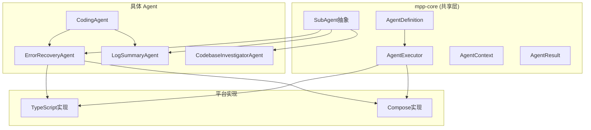
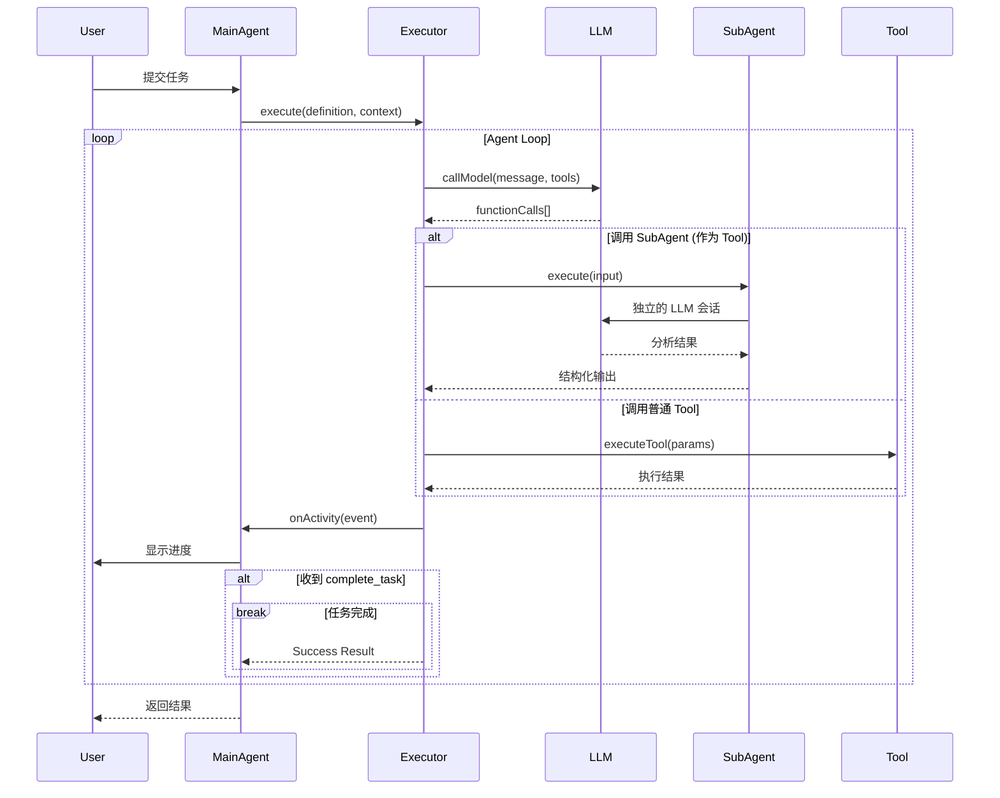
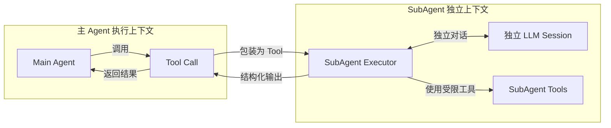
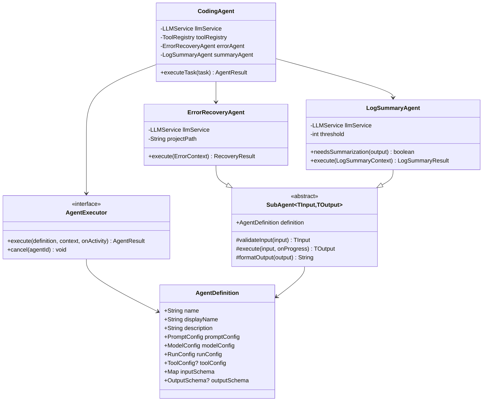

# AI Agent 架构分析与抽象方案

## 一、现有实现分析

### 1.1 AutoCrud 现有 Agent

#### CodingAgentService (主 Agent)
- **职责**：执行完整的开发任务（理解需求 → 编码 → 测试 → 迭代）
- **特点**：
  - 持有 LLMService、ToolRegistry、PromptRenderer
  - 维护执行状态（steps、edits）
  - 支持 Simple Task Mode（保护关键文件）
  - 集成两个 SubAgent（ErrorRecovery、LogSummary）

#### ErrorRecoveryAgent (SubAgent)
- **职责**：分析命令失败原因并提供恢复方案
- **输入**：ErrorContext（command、errorMessage、stdout、stderr、exitCode）
- **输出**：RecoveryResult（analysis、suggestedActions、recoveryCommands、shouldRetry、shouldAbort）
- **流程**：
  1. 检查文件修改（git diff）
  2. 收集错误上下文
  3. LLM 分析并生成恢复计划
  4. 返回结构化结果

#### LogSummaryAgent (SubAgent)
- **职责**：总结长日志输出
- **输入**：LogSummaryContext（command、output、exitCode、executionTime）
- **输出**：LogSummaryResult（summary、keyPoints、errors、warnings、statistics、nextSteps）
- **流程**：
  1. 启发式快速分析（行数、错误数、警告数）
  2. LLM 深度分析（如果长度 > threshold）
  3. 返回结构化摘要

### 1.2 Gemini CLI Agent 架构

#### 核心组件

```typescript
// 1. AgentDefinition - 声明式配置
interface AgentDefinition<TOutput> {
  name: string;
  description: string;
  promptConfig: PromptConfig;    // 系统提示词配置
  modelConfig: ModelConfig;      // 模型参数
  runConfig: RunConfig;          // 运行配置（max_turns、timeout）
  toolConfig?: ToolConfig;       // 可用工具
  inputConfig: InputConfig;      // 输入参数定义
  outputConfig?: OutputConfig<TOutput>; // 输出结构定义
  processOutput?: (output: TOutput) => string;
}

// 2. AgentExecutor - 通用执行引擎
class AgentExecutor<TOutput> {
  async run(inputs: AgentInputs, signal: AbortSignal): Promise<OutputObject>
  - 主循环：callModel → processFunctionCalls → 重复
  - 强制要求调用 complete_task 结束
  - 发送 ActivityCallback 事件
}

// 3. SubagentToolWrapper - 将 SubAgent 包装成 Tool
class SubagentToolWrapper extends BaseDeclarativeTool {
  - 将 AgentDefinition 转换成 FunctionDeclaration
  - 父 Agent 可以像调用 Tool 一样调用 SubAgent
}

// 4. ACP (Agent Communication Protocol) - JSON-RPC 协议
interface Agent {
  initialize(params): Promise<InitializeResponse>;
  newSession(params): Promise<NewSessionResponse>;
  prompt(params): Promise<PromptResponse>;
  cancel(params): Promise<void>;
}
```

#### 设计优势
1. **声明式配置**：Agent 定义与执行逻辑分离
2. **类型安全**：使用 Zod Schema 定义输入输出
3. **SubAgent 即 Tool**：统一的调用接口
4. **标准协议**：JSON-RPC 用于跨进程通信
5. **活动监听**：ActivityCallback 提供可观察性

## 二、抽象接口设计

### 2.1 核心抽象

```kotlin
// mpp-core/src/commonMain/kotlin/cc/unitmesh/agent/

/**
 * Agent 定义 - 声明式配置
 */
data class AgentDefinition(
    val name: String,
    val displayName: String,
    val description: String,
    val promptConfig: PromptConfig,
    val modelConfig: ModelConfig,
    val runConfig: RunConfig,
    val toolConfig: ToolConfig? = null,
    val inputSchema: Map<String, InputParameter>,
    val outputSchema: OutputSchema? = null
)

/**
 * 提示词配置
 */
data class PromptConfig(
    val systemPrompt: String,
    val queryTemplate: String? = null,
    val initialMessages: List<Message> = emptyList()
)

/**
 * 模型配置
 */
data class ModelConfig(
    val modelId: String,
    val temperature: Double = 0.7,
    val maxTokens: Int = 4096,
    val topP: Double = 0.95
)

/**
 * 运行配置
 */
data class RunConfig(
    val maxTurns: Int = 50,
    val maxTimeMinutes: Int = 10,
    val terminateOnError: Boolean = false
)

/**
 * Agent 执行上下文
 */
data class AgentContext(
    val agentId: String,
    val sessionId: String,
    val inputs: Map<String, Any>,
    val projectPath: String,
    val metadata: Map<String, Any> = emptyMap()
)

/**
 * Agent 执行结果
 */
sealed class AgentResult {
    data class Success(
        val output: Map<String, Any>,
        val terminateReason: TerminateReason,
        val steps: List<AgentStep>,
        val metadata: Map<String, Any> = emptyMap()
    ) : AgentResult()
    
    data class Failure(
        val error: String,
        val terminateReason: TerminateReason,
        val steps: List<AgentStep>
    ) : AgentResult()
}

enum class TerminateReason {
    GOAL,           // 目标完成
    MAX_TURNS,      // 达到最大轮次
    TIMEOUT,        // 超时
    ERROR,          // 错误
    ABORTED         // 用户取消
}

/**
 * Agent 活动事件
 */
sealed class AgentActivity {
    data class ToolCallStart(val toolName: String, val args: Map<String, Any>) : AgentActivity()
    data class ToolCallEnd(val toolName: String, val output: String) : AgentActivity()
    data class ThoughtChunk(val text: String) : AgentActivity()
    data class Error(val context: String, val error: String) : AgentActivity()
    data class Progress(val message: String) : AgentActivity()
}

/**
 * Agent 执行器接口
 */
interface AgentExecutor {
    /**
     * 执行 Agent
     */
    suspend fun execute(
        definition: AgentDefinition,
        context: AgentContext,
        onActivity: (AgentActivity) -> Unit = {}
    ): AgentResult
    
    /**
     * 取消执行
     */
    suspend fun cancel(agentId: String)
}

/**
 * SubAgent 抽象基类
 */
abstract class SubAgent<TInput, TOutput>(
    val definition: AgentDefinition
) {
    /**
     * 验证输入
     */
    abstract fun validateInput(input: Map<String, Any>): TInput
    
    /**
     * 执行 SubAgent
     */
    abstract suspend fun execute(
        input: TInput,
        onProgress: (String) -> Unit = {}
    ): TOutput
    
    /**
     * 格式化输出
     */
    abstract fun formatOutput(output: TOutput): String
}
```

### 2.2 具体 SubAgent 实现

```kotlin
/**
 * 错误恢复 SubAgent
 */
class ErrorRecoveryAgent(
    private val llmService: LLMService,
    private val projectPath: String
) : SubAgent<ErrorContext, RecoveryResult>(
    definition = AgentDefinition(
        name = "error_recovery",
        displayName = "Error Recovery SubAgent",
        description = "Analyzes command failures and provides recovery plans",
        promptConfig = PromptConfig(
            systemPrompt = """
                You are an Error Recovery Agent...
                [系统提示词]
            """.trimIndent()
        ),
        modelConfig = ModelConfig(modelId = "gpt-4"),
        runConfig = RunConfig(maxTurns = 5, maxTimeMinutes = 2),
        inputSchema = mapOf(
            "command" to InputParameter("string", true, "失败的命令"),
            "errorMessage" to InputParameter("string", true, "错误信息"),
            "modifiedFiles" to InputParameter("string[]", false, "修改的文件")
        ),
        outputSchema = OutputSchema(
            fields = mapOf(
                "analysis" to "string",
                "suggestedActions" to "string[]",
                "recoveryCommands" to "string[]",
                "shouldRetry" to "boolean",
                "shouldAbort" to "boolean"
            )
        )
    )
) {
    override fun validateInput(input: Map<String, Any>): ErrorContext {
        return ErrorContext(
            command = input["command"] as String,
            errorMessage = input["errorMessage"] as String,
            // ...
        )
    }
    
    override suspend fun execute(
        input: ErrorContext,
        onProgress: (String) -> Unit
    ): RecoveryResult {
        onProgress("Checking for file modifications...")
        val modifiedFiles = getModifiedFiles()
        
        onProgress("Getting diffs...")
        val fileDiffs = getFileDiffs(modifiedFiles)
        
        onProgress("Building error context...")
        val context = buildErrorContext(input, modifiedFiles, fileDiffs)
        
        onProgress("🤖 Analyzing error with AI...")
        val analysis = askLLMForFix(context)
        
        onProgress("✓ Analysis complete")
        return analysis
    }
    
    override fun formatOutput(output: RecoveryResult): String {
        return """
            Analysis: ${output.analysis}
            
            Suggested Actions:
            ${output.suggestedActions.joinToString("\n") { "- $it" }}
            
            Recovery Commands:
            ${output.recoveryCommands?.joinToString("\n") { "$ $it" } ?: "None"}
        """.trimIndent()
    }
}

/**
 * 日志摘要 SubAgent
 */
class LogSummaryAgent(
    private val llmService: LLMService,
    private val threshold: Int = 2000
) : SubAgent<LogSummaryContext, LogSummaryResult>(
    definition = AgentDefinition(
        name = "log_summary",
        displayName = "Log Summary SubAgent",
        description = "Summarizes long command outputs",
        promptConfig = PromptConfig(
            systemPrompt = """
                You are a Log Summary Agent...
                [系统提示词]
            """.trimIndent()
        ),
        modelConfig = ModelConfig(modelId = "gpt-4"),
        runConfig = RunConfig(maxTurns = 3, maxTimeMinutes = 1),
        inputSchema = mapOf(
            "command" to InputParameter("string", true),
            "output" to InputParameter("string", true),
            "exitCode" to InputParameter("integer", true),
            "executionTime" to InputParameter("integer", true)
        ),
        outputSchema = OutputSchema(/*...*/)
    )
) {
    fun needsSummarization(output: String): Boolean = output.length > threshold
    
    override suspend fun execute(
        input: LogSummaryContext,
        onProgress: (String) -> Unit
    ): LogSummaryResult {
        onProgress("Starting log analysis...")
        val heuristics = quickAnalysis(input)
        
        onProgress("Performing AI analysis...")
        val aiResponse = askLLMForSummary(input, heuristics)
        
        onProgress("Parsing results...")
        return parseResponse(aiResponse, heuristics, input)
    }
}
```

## 三、架构图

### 3.1 整体架构



### 3.2 Agent 执行流程



### 3.3 SubAgent 调用模式



### 3.4 类图



## 四、实现方案对比

### 方案 A：放到 mpp-core（推荐）

#### 优势
1. **跨平台复用**：TypeScript、Compose、JVM 都能使用
2. **统一抽象**：强制统一的 Agent 接口和模式
3. **类型安全**：Kotlin 的强类型系统
4. **维护性好**：单一实现，修复 bug 全平台受益

#### 劣势
1. **平台限制**：需要使用 expect/actual 处理平台差异（如文件 I/O、进程调用）
2. **JS 导出限制**：需要注意 Kotlin/JS 导出规则
3. **初期投入大**：需要设计好跨平台抽象

#### 实现策略
```kotlin
// commonMain - 核心抽象
expect class FileSystemOperations {
    suspend fun readFile(path: String): String
    suspend fun listFiles(path: String): List<String>
    suspend fun executeCommand(command: String): CommandResult
}

// jsMain - JS 实现
actual class FileSystemOperations {
    actual suspend fun readFile(path: String): String {
        // Node.js fs.readFile
    }
}

// jvmMain - JVM 实现
actual class FileSystemOperations {
    actual suspend fun readFile(path: String): String {
        // Java File API
    }
}
```

### 方案 B：直接移植到 Compose

#### 优势
1. **快速实现**：直接移植现有代码
2. **无跨平台顾虑**：只关注 JVM 平台
3. **平台特性**：可以使用 JVM 独有特性

#### 劣势
1. **代码重复**：TypeScript 和 Compose 各一套
2. **维护成本高**：修改需要在两处同步
3. **不一致风险**：两个实现可能产生差异

## 五、推荐方案与实施路径

### 推荐：**方案 A - 放到 mpp-core**

#### 理由
1. AutoDev 本身就是跨平台项目（KMP）
2. Agent 是核心能力，应该所有平台受益
3. 长期维护成本更低
4. 符合项目架构理念

### 实施路径

#### Phase 1: 核心抽象（1-2 天）
- [ ] 在 `mpp-core/src/commonMain/kotlin/cc/unitmesh/agent/` 下创建：
  - `AgentDefinition.kt` - Agent 定义
  - `AgentExecutor.kt` - 执行器接口
  - `SubAgent.kt` - SubAgent 抽象基类
  - `AgentContext.kt` - 上下文和结果类型
  - `AgentActivity.kt` - 活动事件

#### Phase 2: 平台适配层（2-3 天）
- [ ] 创建 `expect/actual` 接口：
  - `FileSystemOperations` - 文件操作
  - `ProcessExecutor` - 进程执行
  - `GitOperations` - Git 操作
- [ ] 实现 `jsMain` 版本（基于 Node.js）
- [ ] 实现 `jvmMain` 版本（基于 Java API）

#### Phase 3: SubAgent 实现（3-4 天）
- [ ] 实现 `ErrorRecoveryAgent`
  - 提取现有 TypeScript 逻辑到 Kotlin
  - 适配平台差异
- [ ] 实现 `LogSummaryAgent`
  - 同上
- [ ] 编写单元测试

#### Phase 4: 集成与导出（2-3 天）
- [ ] 在 TypeScript 中使用 mpp-core 的 Agent
  - 替换现有 `ErrorRecoveryAgent.ts`
  - 替换现有 `LogSummaryAgent.ts`
- [ ] 验证 JS 导出正常工作
- [ ] 在 Compose 中使用（如果需要）

#### Phase 5: 文档与优化（1-2 天）
- [ ] 编写使用文档
- [ ] 性能优化
- [ ] 错误处理完善

**总计：9-14 天**

## 六、关键设计决策

### 6.1 SubAgent 作为独立执行单元

**决策**：SubAgent 应该是独立的 Agent 实例，而不是简单的工具函数

**理由**：
1. 独立的 LLM 会话上下文
2. 独立的工具权限控制
3. 独立的超时和重试策略
4. 可以被不同的主 Agent 复用

### 6.2 声明式配置 vs 命令式实现

**决策**：优先使用声明式 `AgentDefinition`，而不是硬编码

**理由**：
1. 配置可以序列化（保存/加载）
2. 易于测试和 Mock
3. 可以在运行时动态创建 Agent
4. 符合 Gemini CLI 的设计理念

### 6.3 结构化输出

**决策**：SubAgent 必须返回结构化数据（不是自由文本）

**理由**：
1. 主 Agent 需要程序化处理结果
2. 类型安全
3. 易于单元测试
4. 避免解析不可靠的 LLM 输出

### 6.4 活动监听机制

**决策**：使用回调函数 `onActivity` 报告 Agent 活动

**理由**：
1. 主 Agent 可以向用户展示进度
2. 可以记录日志用于调试
3. 支持取消和暂停
4. 不阻塞 Agent 执行

## 七、风险与缓解

### 7.1 跨平台兼容性
**风险**：某些平台不支持特定功能（如 JS 中的 git 命令）
**缓解**：
- 使用 expect/actual 提供不同实现
- 提供 fallback 机制
- 明确标注平台限制

### 7.2 性能开销
**风险**：Kotlin/JS 性能可能不如原生 TypeScript
**缓解**：
- 性能测试对比
- 必要时使用 @JsExport 优化
- 关键路径可以保留 TypeScript 实现

### 7.3 LLM 调用成本
**风险**：SubAgent 增加 LLM 调用次数
**缓解**：
- 设置合理的触发阈值（如日志长度 > 2000 才总结）
- 支持禁用 SubAgent
- 使用更便宜的模型（如 gpt-3.5-turbo）

### 7.4 复杂度增加
**风险**：引入 SubAgent 增加系统复杂度
**缓解**：
- 良好的文档和示例
- 单元测试覆盖
- 逐步迁移，保持向后兼容

## 八、总结

推荐采用 **方案 A（放到 mpp-core）**，理由如下：

1. **架构一致性**：符合 AutoDev 的跨平台架构
2. **长期收益**：一次实现，多平台复用
3. **可维护性**：单一代码库，易于维护
4. **类型安全**：Kotlin 的强类型系统
5. **扩展性**：容易添加新的 SubAgent

实施时采用**渐进式迁移**：
1. 先完成核心抽象和平台适配
2. 迁移 ErrorRecoveryAgent
3. 迁移 LogSummaryAgent
4. TypeScript 端逐步切换到使用 mpp-core
5. Compose 端可以直接使用

这样可以在不破坏现有功能的前提下，逐步完成架构升级。


