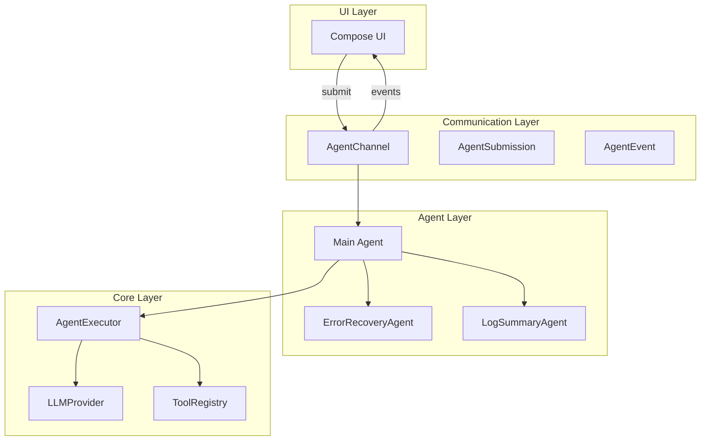

# AI Agent 集成指南

本文档说明如何在 Compose 应用中使用新的 Agent 架构。

## 架构概览



## 核心组件

### 1. AgentDefinition - Agent 定义

声明式配置，定义 Agent 的行为：

```kotlin
val errorRecoveryDef = AgentDefinition(
    name = "error_recovery",
    displayName = "Error Recovery SubAgent",
    description = "Analyzes command failures and provides recovery plans",
    promptConfig = PromptConfig(
        systemPrompt = "You are an Error Recovery Agent..."
    ),
    modelConfig = ModelConfig(
        modelId = "gpt-4",
        temperature = 0.7
    ),
    runConfig = RunConfig(
        maxTurns = 5,
        maxTimeMinutes = 2
    )
)
```

### 2. SubAgent - 子任务执行单元

SubAgent 是独立的执行单元，具有：
- **独立的 LLM 会话**
- **独立的工具权限**
- **结构化的输入输出**

```kotlin
class ErrorRecoveryAgent(
    projectPath: String,
    llmProvider: LLMProvider
) : SubAgent<ErrorContext, RecoveryResult>(definition) {
    
    override fun validateInput(input: Map<String, Any>): ErrorContext {
        return ErrorContext(
            command = input["command"] as String,
            errorMessage = input["errorMessage"] as String
        )
    }
    
    override suspend fun execute(
        input: ErrorContext,
        onProgress: (String) -> Unit
    ): RecoveryResult {
        // 执行逻辑
    }
    
    override fun formatOutput(output: RecoveryResult): String {
        // 格式化输出
    }
}
```

### 3. AgentChannel - 异步通信

使用 Queue Pair 模式解耦 UI 和 Agent：

```kotlin
val channel = AgentChannel()

// UI 提交操作
channel.submit(AgentSubmission.SendPrompt("Fix the build error"))

// Agent 发送事件
channel.emit(AgentEvent.Progress(1, 5, "Analyzing error..."))

// UI 监听事件
channel.events().collect { event ->
    when (event) {
        is AgentEvent.StreamUpdate -> updateUI(event.text)
        is AgentEvent.Progress -> showProgress(event)
        is AgentEvent.Error -> showError(event.message)
    }
}
```

## 使用示例

### 示例 1: 在主 Agent 中使用 ErrorRecoveryAgent

```kotlin
class CodingAgent(
    private val projectPath: String,
    private val llmProvider: LLMProvider,
    private val channel: AgentChannel
) {
    private val errorRecoveryAgent = ErrorRecoveryAgent(projectPath, llmProvider)
    private val logSummaryAgent = LogSummaryAgent(llmProvider)
    
    suspend fun executeShellCommand(command: String) {
        channel.emit(AgentEvent.ToolCallStart("shell", command))
        
        val result = executeCommand(command)
        
        if (!result.success) {
            // 激活 ErrorRecovery SubAgent
            channel.emit(AgentEvent.SubAgentStart(
                "error_recovery",
                "Analyzing command failure"
            ))
            
            val recovery = errorRecoveryAgent.run(
                rawInput = mapOf(
                    "command" to command,
                    "errorMessage" to result.error,
                    "exitCode" to result.exitCode
                ),
                onProgress = { progress ->
                    channel.emit(AgentEvent.Progress(0, 0, progress))
                }
            )
            
            channel.emit(AgentEvent.SubAgentComplete(
                "error_recovery",
                recovery
            ))
            
            // 展示恢复建议给用户
            channel.emit(AgentEvent.StreamUpdate(recovery))
        }
        
        // 如果输出很长，使用 LogSummary SubAgent
        if (logSummaryAgent.needsSummarization(result.output)) {
            channel.emit(AgentEvent.SubAgentStart(
                "log_summary",
                "Summarizing command output"
            ))
            
            val summary = logSummaryAgent.run(
                rawInput = mapOf(
                    "command" to command,
                    "output" to result.output,
                    "exitCode" to result.exitCode,
                    "executionTime" to result.executionTime
                ),
                onProgress = { progress ->
                    channel.emit(AgentEvent.Progress(0, 0, progress))
                }
            )
            
            channel.emit(AgentEvent.SubAgentComplete(
                "log_summary",
                summary
            ))
            
            channel.emit(AgentEvent.StreamUpdate(summary))
        }
    }
}
```

### 示例 2: 在 Compose UI 中使用

```kotlin
@Composable
fun CodingAgentScreen(
    viewModel: CodingAgentViewModel
) {
    val events by viewModel.events.collectAsState(initial = emptyList())
    
    Column(modifier = Modifier.fillMaxSize()) {
        // 显示事件流
        LazyColumn(modifier = Modifier.weight(1f)) {
            items(events) { event ->
                when (event) {
                    is AgentEvent.StreamUpdate -> {
                        MessageBubble(text = event.text)
                    }
                    is AgentEvent.Progress -> {
                        ProgressIndicator(
                            current = event.step,
                            total = event.total,
                            message = event.message
                        )
                    }
                    is AgentEvent.SubAgentStart -> {
                        SubAgentCard(
                            name = event.agentName,
                            status = "Running",
                            purpose = event.purpose
                        )
                    }
                    is AgentEvent.SubAgentComplete -> {
                        SubAgentCard(
                            name = event.agentName,
                            status = "Complete",
                            result = event.result
                        )
                    }
                    is AgentEvent.Error -> {
                        ErrorMessage(text = event.message)
                    }
                }
            }
        }
        
        // 输入区
        InputField(
            onSubmit = { text ->
                viewModel.submit(AgentSubmission.SendPrompt(text))
            }
        )
    }
}

class CodingAgentViewModel : ViewModel() {
    private val channel = AgentChannel()
    private val agent = CodingAgent(
        projectPath = "/path/to/project",
        llmProvider = createLLMProvider(),
        channel = channel
    )
    
    val events: StateFlow<List<AgentEvent>> = channel.events()
        .scan(emptyList<AgentEvent>()) { acc, event -> acc + event }
        .stateIn(viewModelScope, SharingStarted.Lazily, emptyList())
    
    fun submit(submission: AgentSubmission) {
        viewModelScope.launch {
            channel.submit(submission)
        }
    }
    
    init {
        viewModelScope.launch {
            channel.submissions().collect { submission ->
                when (submission) {
                    is AgentSubmission.SendPrompt -> {
                        agent.handlePrompt(submission.text)
                    }
                    is AgentSubmission.CancelTask -> {
                        agent.cancel()
                    }
                }
            }
        }
    }
}
```

### 示例 3: 直接使用 SubAgent（单元测试）

```kotlin
@Test
fun `ErrorRecoveryAgent should analyze build failure`() = runTest {
    val agent = ErrorRecoveryAgent(
        projectPath = "/test/project",
        llmProvider = mockLLMProvider()
    )
    
    val result = agent.run(
        rawInput = mapOf(
            "command" to "./gradlew build",
            "errorMessage" to "Compilation failed: syntax error"
        ),
        onProgress = { println(it) }
    )
    
    assertThat(result).contains("syntax error")
    assertThat(result).contains("Suggested Actions")
}
```

## SubAgent 设计模式

### 模式 1: 错误恢复模式

当操作失败时，启动 SubAgent 分析原因并提供恢复方案：

```kotlin
try {
    val result = executeDangerousOperation()
} catch (e: Exception) {
    val recovery = errorRecoveryAgent.run(
        mapOf("error" to e.message)
    )
    // 应用恢复方案
}
```

### 模式 2: 后处理模式

主 Agent 执行操作后，SubAgent 处理和总结结果：

```kotlin
val output = executeCommand("npm test")

if (logSummaryAgent.needsSummarization(output)) {
    val summary = logSummaryAgent.run(
        mapOf("output" to output)
    )
    return summary
}
```

### 模式 3: 预处理模式

在主操作之前，SubAgent 先分析和准备：

```kotlin
val investigation = codebaseInvestigatorAgent.run(
    mapOf("objective" to "Find authentication code")
)

// 基于调查结果执行修改
modifyFiles(investigation.relevantFiles)
```

## 创建自定义 SubAgent

### Step 1: 定义输入输出类型

```kotlin
@Serializable
data class CodeReviewContext(
    val filePath: String,
    val changes: String
)

@Serializable
data class CodeReviewResult(
    val issues: List<String>,
    val suggestions: List<String>,
    val overallScore: Int
)
```

### Step 2: 实现 SubAgent

```kotlin
class CodeReviewAgent(
    private val llmProvider: LLMProvider
) : SubAgent<CodeReviewContext, CodeReviewResult>(
    definition = AgentDefinition(
        name = "code_review",
        displayName = "Code Review SubAgent",
        description = "Reviews code changes for quality and security",
        promptConfig = PromptConfig(
            systemPrompt = "You are a code review expert..."
        ),
        modelConfig = ModelConfig(modelId = "gpt-4"),
        runConfig = RunConfig(maxTurns = 3, maxTimeMinutes = 2)
    )
) {
    override fun validateInput(input: Map<String, Any>): CodeReviewContext {
        return CodeReviewContext(
            filePath = input["filePath"] as String,
            changes = input["changes"] as String
        )
    }
    
    override suspend fun execute(
        input: CodeReviewContext,
        onProgress: (String) -> Unit
    ): CodeReviewResult {
        onProgress("Reviewing ${input.filePath}...")
        
        val prompt = """
            Review this code change:
            File: ${input.filePath}
            Changes:
            ${input.changes}
            
            Provide feedback in JSON format.
        """.trimIndent()
        
        val response = llmProvider.completion(
            definition.promptConfig.systemPrompt,
            prompt
        )
        
        return parseReviewResponse(response)
    }
    
    override fun formatOutput(output: CodeReviewResult): String {
        return buildString {
            appendLine("📝 Code Review Results")
            appendLine("Score: ${output.overallScore}/10")
            
            if (output.issues.isNotEmpty()) {
                appendLine("\n❌ Issues:")
                output.issues.forEach { appendLine("  - $it") }
            }
            
            if (output.suggestions.isNotEmpty()) {
                appendLine("\n💡 Suggestions:")
                output.suggestions.forEach { appendLine("  - $it") }
            }
        }
    }
}
```

### Step 3: 集成到主 Agent

```kotlin
class CodingAgent {
    private val codeReviewAgent = CodeReviewAgent(llmProvider)
    
    suspend fun beforeCommit(files: List<String>) {
        for (file in files) {
            val changes = getGitDiff(file)
            val review = codeReviewAgent.run(
                mapOf(
                    "filePath" to file,
                    "changes" to changes
                )
            )
            
            channel.emit(AgentEvent.StreamUpdate(review))
        }
    }
}
```

## 最佳实践

### 1. 使用进度回调

SubAgent 应该报告进度，让用户了解执行状态：

```kotlin
override suspend fun execute(
    input: TInput,
    onProgress: (String) -> Unit
): TOutput {
    onProgress("Step 1: Preparing...")
    // ...
    onProgress("Step 2: Analyzing...")
    // ...
    onProgress("Step 3: Complete")
    return result
}
```

### 2. 结构化输入输出

使用数据类而非 Map<String, Any>：

```kotlin
// 好 ✅
@Serializable
data class Input(val command: String, val error: String)

// 避免 ❌
val input: Map<String, Any> = mapOf("command" to "...", "error" to "...")
```

### 3. 错误处理

SubAgent 应该优雅地处理错误：

```kotlin
override suspend fun execute(input: TInput, onProgress: (String) -> Unit): TOutput {
    return try {
        // 主逻辑
        performAnalysis(input)
    } catch (e: Exception) {
        onProgress("Error: ${e.message}")
        // 返回降级结果
        createFallbackResult(e)
    }
}
```

### 4. 超时控制

使用 `withTimeout` 防止 SubAgent 运行过长：

```kotlin
suspend fun runWithTimeout(input: Map<String, Any>): String {
    return withTimeout(definition.runConfig.maxTimeMinutes * 60 * 1000L) {
        run(input)
    }
}
```

## 测试策略

### 单元测试 SubAgent

```kotlin
class ErrorRecoveryAgentTest {
    private lateinit var agent: ErrorRecoveryAgent
    private lateinit var mockLLM: LLMProvider
    
    @Before
    fun setup() {
        mockLLM = mockk<LLMProvider>()
        agent = ErrorRecoveryAgent("/test/path", mockLLM)
    }
    
    @Test
    fun `should validate input correctly`() {
        val input = mapOf(
            "command" to "./gradlew build",
            "errorMessage" to "Build failed"
        )
        
        val validated = agent.validateInput(input)
        
        assertEquals("./gradlew build", validated.command)
        assertEquals("Build failed", validated.errorMessage)
    }
    
    @Test
    fun `should throw exception for invalid input`() {
        val input = mapOf("invalid" to "data")
        
        assertThrows<IllegalArgumentException> {
            agent.validateInput(input)
        }
    }
}
```

### 集成测试

```kotlin
@Test
fun `full agent workflow`() = runTest {
    val channel = AgentChannel()
    val agent = CodingAgent(projectPath, llmProvider, channel)
    
    val events = mutableListOf<AgentEvent>()
    
    launch {
        channel.events().take(5).toList(events)
    }
    
    channel.submit(AgentSubmission.SendPrompt("Fix build error"))
    
    delay(1000)
    
    assertTrue(events.any { it is AgentEvent.SubAgentStart })
    assertTrue(events.any { it is AgentEvent.SubAgentComplete })
}
```

## 性能优化

### 1. 缓存 SubAgent 结果

```kotlin
class CodingAgent {
    private val recoveryCache = mutableMapOf<String, RecoveryResult>()
    
    suspend fun executeWithCache(command: String) {
        val cacheKey = command.hashCode().toString()
        
        val cached = recoveryCache[cacheKey]
        if (cached != null) {
            return cached
        }
        
        val result = errorRecoveryAgent.run(...)
        recoveryCache[cacheKey] = result
        return result
    }
}
```

### 2. 并行执行多个 SubAgent

```kotlin
suspend fun analyzeCodebase(files: List<String>) {
    val results = files.map { file ->
        async {
            codeReviewAgent.run(mapOf("filePath" to file))
        }
    }.awaitAll()
    
    return results
}
```

### 3. 限制并发数

```kotlin
val semaphore = Semaphore(3) // 最多 3 个并发

suspend fun executeWithLimit(file: String) {
    semaphore.withPermit {
        agent.run(mapOf("file" to file))
    }
}
```

## 故障排查

### 问题 1: SubAgent 超时

**症状**: SubAgent 运行时间过长

**解决方案**:
```kotlin
// 减少 maxTurns
val definition = AgentDefinition(
    runConfig = RunConfig(maxTurns = 3) // 从 10 减少到 3
)

// 使用更快的模型
val definition = AgentDefinition(
    modelConfig = ModelConfig(modelId = "gpt-3.5-turbo") // 而非 gpt-4
)
```

### 问题 2: 输入验证失败

**症状**: `IllegalArgumentException` 在 validateInput

**解决方案**:
```kotlin
// 添加日志
override fun validateInput(input: Map<String, Any>): TInput {
    println("Validating input: $input")
    require(input.containsKey("command")) { "command is required" }
    // ...
}
```

### 问题 3: LLM 返回格式错误

**症状**: JSON 解析失败

**解决方案**:
```kotlin
// 添加回退逻辑
private fun parseResponse(response: String): Result {
    return try {
        json.decodeFromString<Result>(response)
    } catch (e: Exception) {
        println("Parse failed, using fallback")
        createFallbackResult(response)
    }
}
```

## 下一步

- [ ] 查看 [agent-architecture-analysis.md](agent-architecture-analysis.md) 了解完整架构
- [ ] 参考 TypeScript 实现: `mpp-ui/src/jsMain/typescript/agents/`
- [ ] 运行测试: `./gradlew :mpp-core:jvmTest`
- [ ] 查看示例项目: `examples/coding-agent-demo`

## 贡献

欢迎提交新的 SubAgent 实现！请遵循以下步骤：

1. 继承 `SubAgent<TInput, TOutput>`
2. 定义清晰的输入输出数据类
3. 实现三个核心方法: `validateInput`, `execute`, `formatOutput`
4. 添加单元测试
5. 更新本文档

---

**反馈和问题**: 请在 GitHub Issues 中提出


