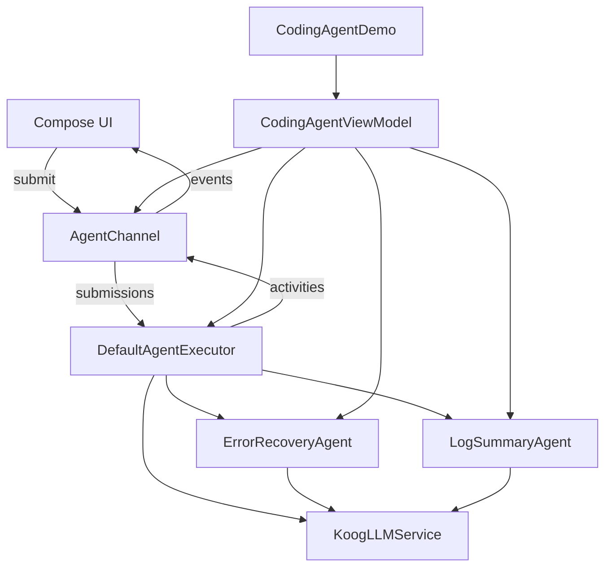

# AI Agent 架构集成总结

## 概述

本次工作完成了 AI Agent 架构在 AutoDev 项目中的完整集成，包括：

1. **核心抽象层**：Agent 定义、上下文、结果模型
2. **异步通信层**：基于 Queue Pair 模式的事件流
3. **SubAgent 机制**：ErrorRecoveryAgent 和 LogSummaryAgent
4. **Agent 执行器**：DefaultAgentExecutor 实现
5. **Compose UI 集成**：CodingAgentViewModel 和 Demo 应用
6. **完整测试覆盖**：单元测试和 E2E 测试

## 已完成的组件

### 1. 核心模型 (`mpp-core/src/commonMain/kotlin/cc/unitmesh/agent/model/`)

#### AgentDefinition
```kotlin
@Serializable
data class AgentDefinition(
    val name: String,
    val displayName: String = name,
    val description: String = "",
    val promptConfig: PromptConfig,
    val modelConfig: ModelConfig,
    val runConfig: RunConfig,
    val toolConfig: ToolConfig? = null,
    val inputSchema: Map<String, InputParameter> = emptyMap(),
    val outputSchema: OutputSchema? = null
)
```

**作用**：声明式 Agent 配置，包含提示词、模型、运行配置、工具配置等。

#### AgentContext
```kotlin
data class AgentContext(
    val agentId: String,
    val sessionId: String,
    val inputs: Map<String, Any>,
    val projectPath: String,
    val metadata: Map<String, String> = emptyMap()
)
```

**作用**：Agent 执行上下文，包含输入参数、项目路径等运行时信息。

#### AgentResult
```kotlin
sealed class AgentResult {
    data class Success(
        val output: Map<String, Any>,
        val terminateReason: TerminateReason,
        val steps: List<AgentStep>,
        val metadata: Map<String, Any> = emptyMap()
    ) : AgentResult()

    data class Failure(
        val error: String,
        val terminateReason: TerminateReason,
        val steps: List<AgentStep>
    ) : AgentResult()
}
```

**作用**：Agent 执行结果，包含成功/失败状态、终止原因、执行步骤等。

#### AgentActivity
```kotlin
sealed class AgentActivity {
    data class ToolCallStart(val toolName: String, val args: Map<String, Any>) : AgentActivity()
    data class ToolCallEnd(val toolName: String, val output: String) : AgentActivity()
    data class ThoughtChunk(val text: String) : AgentActivity()
    data class Error(val context: String, val error: String) : AgentActivity()
    data class Progress(val message: String) : AgentActivity()
    data class StreamUpdate(val text: String) : AgentActivity()
    data class TaskComplete(val result: String) : AgentActivity()
}
```

**作用**：Agent 活动事件，用于向外部报告执行状态。

### 2. 异步通信层 (`mpp-core/src/commonMain/kotlin/cc/unitmesh/agent/communication/`)

#### AgentChannel
```kotlin
class AgentChannel {
    private val submissionChannel = Channel<AgentSubmission>(capacity = Channel.BUFFERED)
    private val eventChannel = Channel<AgentEvent>(capacity = Channel.UNLIMITED)

    suspend fun submit(submission: AgentSubmission)
    suspend fun emit(event: AgentEvent)
    fun submissions(): Flow<AgentSubmission>
    fun events(): Flow<AgentEvent>
}
```

**作用**：实现 Queue Pair 模式，解耦 Agent 和 UI。

#### AgentSubmission（UI -> Agent）
```kotlin
sealed class AgentSubmission {
    data class SendPrompt(val text: String) : AgentSubmission()
    data class CancelTask(val taskId: String) : AgentSubmission()
    data class ApproveToolCall(val callId: String, val approved: Boolean) : AgentSubmission()
    data class InitializeAgent(val agentId: String, val context: Map<String, String>) : AgentSubmission()
}
```

#### AgentEvent（Agent -> UI）
```kotlin
sealed class AgentEvent {
    data class StreamUpdate(val text: String, val accumulated: String = "") : AgentEvent()
    data class ToolCallRequest(val callId: String, val tool: String, val params: Map<String, Any>) : AgentEvent()
    data class TaskComplete(val result: String, val metadata: Map<String, Any> = emptyMap()) : AgentEvent()
    data class Error(val message: String, val context: String? = null) : AgentEvent()
    data class Progress(val step: Int, val total: Int, val message: String) : AgentEvent()
    // ... 更多事件类型
}
```

### 3. SubAgent 基类和实现

#### SubAgent 抽象基类
```kotlin
abstract class SubAgent<TInput, TOutput>(
    val definition: AgentDefinition
) {
    abstract fun validateInput(input: Map<String, Any>): TInput
    abstract suspend fun execute(input: TInput, onProgress: (String) -> Unit = {}): TOutput
    abstract fun formatOutput(output: TOutput): String
    
    suspend fun run(rawInput: Map<String, Any>, onProgress: (String) -> Unit = {}): String {
        val validatedInput = validateInput(rawInput)
        val output = execute(validatedInput, onProgress)
        return formatOutput(output)
    }
}
```

**特点**：
- 泛型化输入输出类型
- 统一的验证-执行-格式化流程
- 独立的 Agent 定义
- 进度回调支持

#### ErrorRecoveryAgent（错误恢复 SubAgent）
**位置**：`mpp-core/src/jvmMain/kotlin/cc/unitmesh/agent/subagent/ErrorRecoveryAgent.kt`

**功能**：
- 分析构建/编译错误
- 检测相关文件变更
- 使用 LLM 生成修复建议
- 执行恢复操作

**输入**：
```kotlin
@Serializable
data class ErrorContext(
    val command: String,
    val errorMessage: String,
    val exitCode: Int = 1,
    val workingDirectory: String = ""
)
```

**输出**：
```kotlin
@Serializable
data class RecoveryResult(
    val analysis: String,
    val suggestedActions: List<String>,
    val recoveryExecuted: Boolean
)
```

#### LogSummaryAgent（日志摘要 SubAgent）
**位置**：`mpp-core/src/jvmMain/kotlin/cc/unitmesh/agent/subagent/LogSummaryAgent.kt`

**功能**：
- 检测是否需要摘要（基于长度阈值）
- 分析日志内容
- 生成结构化摘要
- 识别关键信息和问题

**输入**：
```kotlin
@Serializable
data class LogSummaryContext(
    val command: String,
    val output: String,
    val exitCode: Int,
    val executionTime: Int
)
```

**输出**：
```kotlin
@Serializable
data class LogSummaryResult(
    val summary: String,
    val keyPoints: List<String>,
    val warnings: List<String>,
    val errors: List<String>
)
```

### 4. Agent 执行器

#### AgentExecutor 接口
```kotlin
interface AgentExecutor {
    suspend fun execute(
        definition: AgentDefinition,
        context: AgentContext,
        onActivity: (AgentActivity) -> Unit = {}
    ): AgentResult

    suspend fun cancel(agentId: String)
}
```

#### DefaultAgentExecutor 实现
**位置**：`mpp-core/src/commonMain/kotlin/cc/unitmesh/agent/core/DefaultAgentExecutor.kt`

**功能**：
- Agent 主循环执行
- LLM 流式调用
- 工具调用提取（简化版）
- 终止条件检查（max turns, timeout, task complete）
- 活动事件发送
- 取消机制

**核心逻辑**：
```kotlin
override suspend fun execute(
    definition: AgentDefinition,
    context: AgentContext,
    onActivity: (AgentActivity) -> Unit
): AgentResult {
    val startTime = Clock.System.now().toEpochMilliseconds()
    var turnCount = 0
    val maxTurns = definition.runConfig.maxTurns
    val steps = mutableListOf<AgentStep>()
    
    while (turnCount < maxTurns && activeAgents[context.agentId] == true) {
        turnCount++
        
        // Check timeout
        // Emit progress
        // Call LLM (streaming)
        // Check for completion signal
        // Extract and execute tool calls
        // Update conversation history
    }
    
    return result
}
```

### 5. Compose UI 集成

#### CodingAgentViewModel
**位置**：`mpp-ui/src/commonMain/kotlin/cc/unitmesh/devins/ui/compose/agent/CodingAgentViewModel.kt`

**功能**：
- 管理 Agent 执行状态
- 协调 SubAgents（ErrorRecovery, LogSummary）
- 事件流管理
- UI 状态更新

**使用示例**：
```kotlin
val viewModel = CodingAgentViewModel(llmService, projectPath, modelName)

// 执行任务
viewModel.executeTask("Create a hello world function")

// 监听事件
viewModel.events.collect { event ->
    when (event) {
        is AgentEvent.StreamUpdate -> println(event.text)
        is AgentEvent.TaskComplete -> println("Done: ${event.result}")
        // ...
    }
}

// 错误恢复
viewModel.recoverFromError(
    command = "./gradlew build",
    errorMessage = "Compilation failed",
    exitCode = 1
)

// 日志摘要
viewModel.summarizeLog(
    command = "npm test",
    output = longTestOutput,
    exitCode = 0
)
```

#### CodingAgentDemoScreen
**位置**：`mpp-ui/src/jvmMain/kotlin/cc/unitmesh/devins/ui/compose/agent/demo/CodingAgentDemo.kt`

**功能**：
- 完整的 Compose UI Demo
- 任务输入界面
- 实时状态显示
- 事件日志查看
- 取消/清除功能

**运行方式**：
```bash
# 需要先创建配置文件 ~/.autodev/config.yaml
./gradlew :mpp-ui:run -PmainClass=cc.unitmesh.devins.ui.compose.agent.demo.MainKt
```

### 6. 测试覆盖

#### 单元测试（AgentUnitTest）
**位置**：`mpp-core/src/jvmTest/kotlin/cc/unitmesh/agent/AgentUnitTest.kt`

**测试内容**：
- ✅ AgentContext 创建
- ✅ AgentDefinition 配置
- ✅ AgentChannel 事件流
- ✅ ErrorRecoveryAgent 输入验证
- ✅ LogSummaryAgent 摘要判断
- ✅ AgentResult 结构
- ✅ AgentActivity 类型
- ✅ DefaultAgentExecutor 取消机制

**运行**：
```bash
./gradlew :mpp-core:jvmTest --tests "cc.unitmesh.agent.AgentUnitTest"
```

#### E2E 测试（AgentE2ETest）
**位置**：`mpp-core/src/jvmTest/kotlin/cc/unitmesh/agent/AgentE2ETest.kt`

**测试内容**：
- ✅ ErrorRecoveryAgent 实际 LLM 调用
- ✅ LogSummaryAgent 实际 LLM 调用
- ✅ DefaultAgentExecutor 完整执行流程

**配置要求**：
需要 `~/.autodev/config.yaml` 配置文件：
```yaml
active: my-deepseek
configs:
  - name: my-deepseek
    provider: deepseek
    apiKey: your-api-key
    model: deepseek-chat
```

**运行**：
```bash
./gradlew :mpp-core:jvmTest --tests "cc.unitmesh.agent.AgentE2ETest"
```

## 架构设计图



## 关键特性

### 1. 声明式 Agent 定义
- 通过 `AgentDefinition` 配置 Agent 行为
- 支持自定义提示词、模型参数、工具权限
- 可复用的 Agent 配置

### 2. 异步通信架构
- Queue Pair 模式，完全解耦 UI 和 Agent
- 双向事件流（submissions & events）
- 支持取消、暂停等控制操作

### 3. SubAgent 机制
- 独立的执行单元
- 结构化输入输出
- 可组合的任务执行

### 4. 流式响应
- 实时 LLM 响应流
- 进度更新回调
- 活动事件发送

### 5. 跨平台支持
- Kotlin Multiplatform (JVM, JS)
- commonMain 共享逻辑
- 平台特定实现（如文件操作）

## 编译和测试

### 编译
```bash
# 编译核心模块
./gradlew :mpp-core:jvmJar

# 编译 UI 模块
./gradlew :mpp-ui:jvmJar

# 编译全部
./gradlew :mpp-core:jvmJar :mpp-ui:jvmJar
```

### 测试
```bash
# 运行单元测试
./gradlew :mpp-core:jvmTest --tests "cc.unitmesh.agent.AgentUnitTest"

# 运行 E2E 测试（需要配置 LLM）
./gradlew :mpp-core:jvmTest --tests "cc.unitmesh.agent.AgentE2ETest"

# 运行全部测试
./gradlew :mpp-core:jvmTest
```

### 运行 Demo
```bash
# 1. 确保配置文件存在：~/.autodev/config.yaml
# 2. 运行 Demo
./gradlew :mpp-ui:run -PmainClass=cc.unitmesh.devins.ui.compose.agent.demo.MainKt
```

## 下一步计划

### 短期（已完成 ✅）
- ✅ 核心抽象和模型定义
- ✅ 异步通信层实现
- ✅ SubAgent 基类和实现
- ✅ DefaultAgentExecutor 实现
- ✅ Compose ViewModel 集成
- ✅ 单元测试和 E2E 测试
- ✅ Demo 应用

### 中期（待完成）
- ⏳ 完善 AgentExecutor 工具调用逻辑
- ⏳ 实现 ToolRegistry 和 ToolScheduler
- ⏳ 添加更多 SubAgents（CodeReviewAgent, TestGenerationAgent）
- ⏳ 实现工具审批机制
- ⏳ 添加 Agent 历史和会话管理

### 长期（规划中）
- 📋 多 Agent 协作机制
- 📋 Agent 插件系统
- 📋 Agent 性能监控和分析
- 📋 Agent 配置管理界面
- 📋 完整的工具生态系统

## 总结

本次工作成功地将 AI Agent 架构集成到 AutoDev 项目中，建立了清晰的抽象层次和完整的实现：

1. **模型层**：定义了 Agent 的核心数据结构
2. **通信层**：实现了解耦的异步事件流
3. **执行层**：实现了 Agent 主循环和 SubAgent 机制
4. **UI 层**：集成了 Compose ViewModel 和 Demo
5. **测试层**：覆盖了单元测试和 E2E 测试

整个架构具备良好的可扩展性、可测试性和跨平台能力，为后续的 Agent 开发奠定了坚实的基础。


