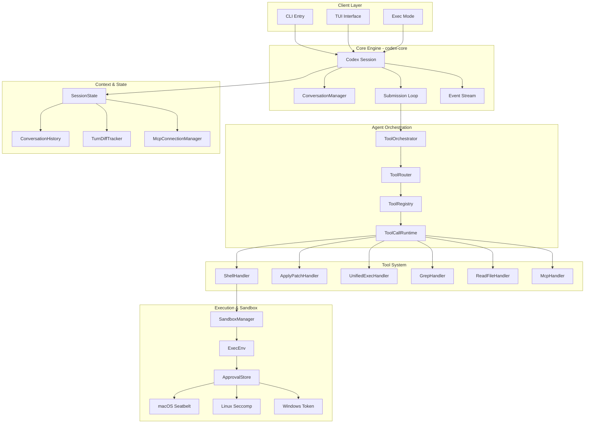
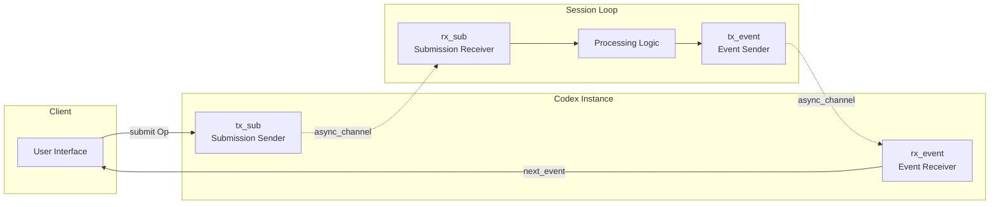
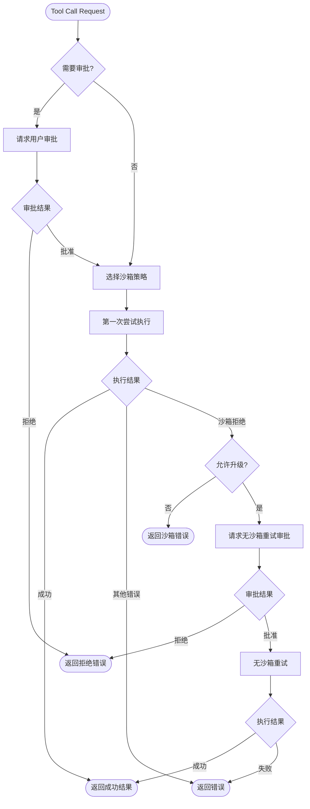
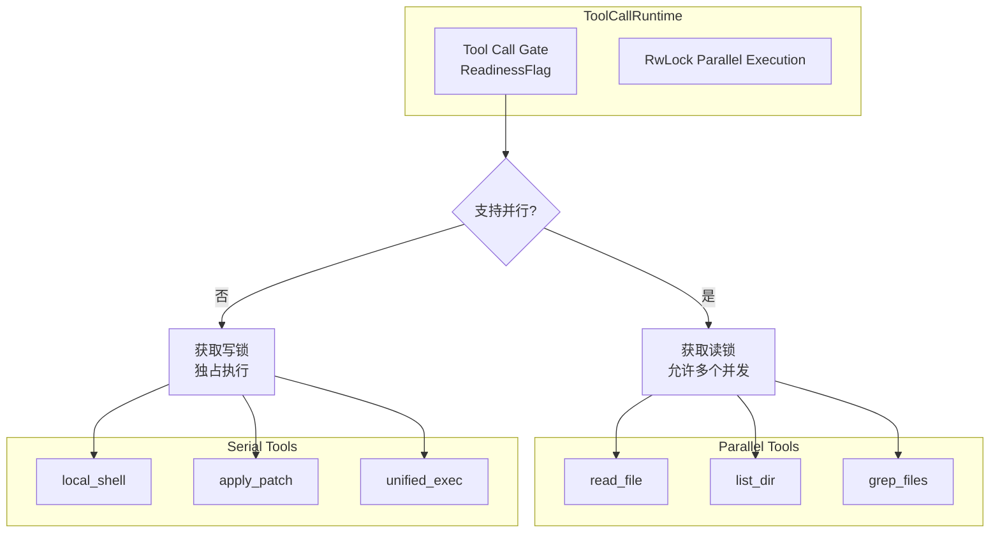
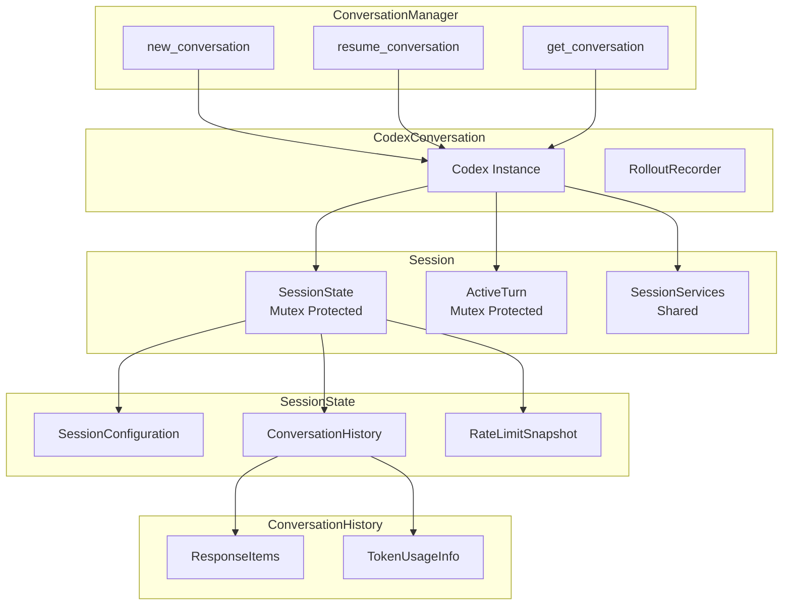
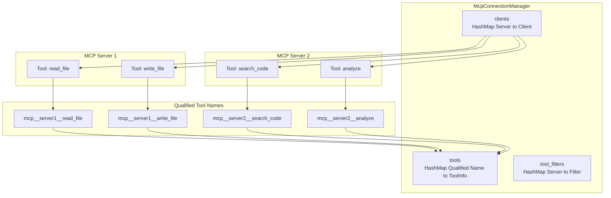
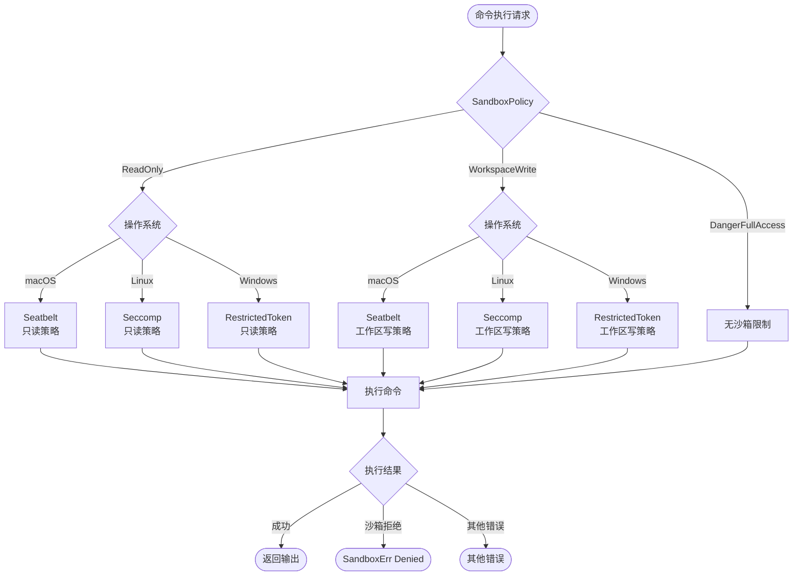
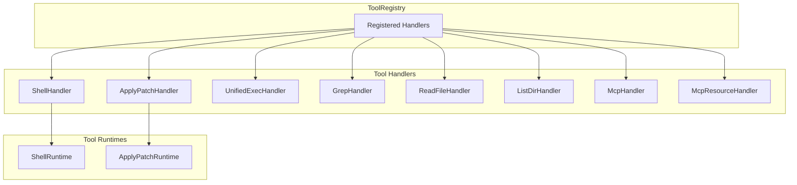
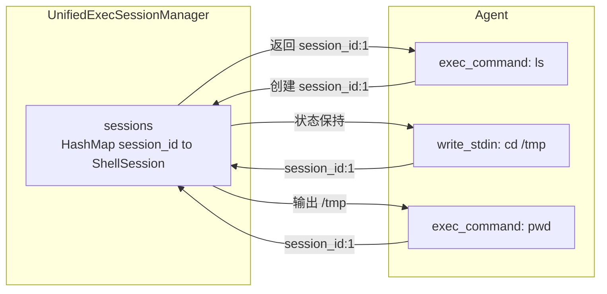
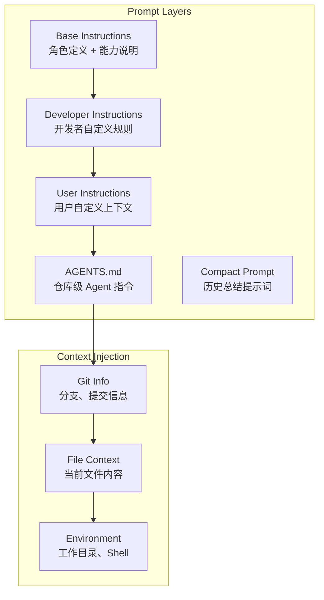

# Codex Coding Agent - 架构分析与实现解析

## 📋 概述

Codex 是 OpenAI 开源的终端代码助手，采用 Rust 实现的生产级 Coding Agent。本文档深入分析 Codex 的核心架构设计，为 AutoDev 项目提供参考。

---

## 🏗️ 核心架构

### 系统架构全景图



---

## 🔑 核心设计模式

### 1. Queue Pair 通信模式

**Problem**: Agent 需要处理异步的用户输入和 LLM 响应，同时保持系统的响应性和可控性。

**Solution**: Codex 使用双向队列对（Queue Pair）实现生产者-消费者模式。



**核心代码结构**:
```rust
pub struct Codex {
    tx_sub: Sender<Submission>,     // 提交命令到 Session
    rx_event: Receiver<Event>,      // 接收 Session 事件
}

pub async fn submit(&self, op: Op) -> CodexResult<String>
pub async fn next_event(&self) -> CodexResult<Event>
```

**优势**:
- **解耦**: UI 和核心逻辑完全分离
- **异步**: 非阻塞通信，提升响应性
- **背压**: Channel 容量控制防止内存溢出
- **可测试**: 易于模拟和单元测试

---

### 2. Tool Orchestrator 模式

**Problem**: 工具调用需要处理复杂的审批流程、沙箱策略和错误重试逻辑。

**Root Cause**: 不同工具有不同的权限需求和执行环境，需要统一的编排机制。

**Solution**: ToolOrchestrator 实现了标准化的工具执行流程。



**核心流程**:
1. **审批阶段**: 根据 `AskForApproval` 策略决定是否需要用户批准
2. **沙箱选择**: 基于配置的 `SandboxPolicy` 和工具的 `sandbox_preference()`
3. **首次执行**: 在选定的沙箱环境中执行
4. **失败重试**: 沙箱拒绝时，可选择升级到无沙箱环境重新执行

**关键特性**:
- **审批缓存**: 已批准的操作在会话中缓存，避免重复询问
- **风险评估**: `assess_sandbox_command()` 分析命令危险性
- **透明升级**: 沙箱失败时自动尝试无沙箱环境

---

### 3. Parallel Tool Execution 并行工具执行

**Problem**: Agent 需要同时执行多个工具调用以提高效率，但某些工具不支持并发。

**Solution**: 使用读写锁（RwLock）区分并行和串行工具。



**实现细节**:
```rust
pub struct ToolCallRuntime {
    parallel_execution: Arc<RwLock<()>>,  // 控制并发
}

let _guard = if supports_parallel {
    Either::Left(lock.read().await)   // 读锁：多个并发
} else {
    Either::Right(lock.write().await) // 写锁：独占访问
};
```

**优势**:
- **高效并发**: 读操作（文件读取、搜索）可并行执行
- **数据一致性**: 写操作（Shell 命令、文件修改）串行执行
- **取消支持**: 通过 `CancellationToken` 统一取消机制

---

### 4. Conversation & State Management 会话状态管理

**Problem**: Agent 需要维护多轮对话的上下文、历史记录和状态信息。

**Solution**: 分层的状态管理架构。



**状态隔离**:
- **SessionState**: 持久化配置和历史记录（Mutex 保护）
- **ActiveTurn**: 当前回合的临时状态（Mutex 保护）
- **SessionServices**: 共享服务（Arc 共享，无锁）

**持久化机制**:
- **RolloutRecorder**: 实时记录对话到磁盘
- **Checkpoint**: 支持从任意历史点恢复会话

---

### 5. MCP (Model Context Protocol) Integration

**Problem**: Agent 需要集成外部工具和服务，但每个服务的接口不同。

**Solution**: MCP 标准化工具协议，统一管理多个 MCP 服务器。



**命名规范**:
```
mcp__<server_name>__<tool_name>
```

**特性**:
- **动态注册**: 运行时启动 MCP 服务器
- **工具聚合**: 统一管理所有 MCP 工具
- **过滤器**: 可配置每个服务器的工具白名单
- **资源访问**: 支持 MCP 资源读取（Resources）

---

## 🛡️ 沙箱与安全机制

### 多层沙箱策略



**平台特定实现**:

| 平台 | 技术 | 实现位置 |
|------|------|----------|
| macOS | Seatbelt (sandbox-exec) | `seatbelt.rs` |
| Linux | Seccomp + Landlock | `landlock.rs` + `linux-sandbox/` |
| Windows | Restricted Token | `windows-sandbox-rs/` |

**沙箱能力**:
- **文件系统隔离**: 限制读写路径
- **网络隔离**: 阻止网络访问（可选）
- **进程隔离**: 限制子进程创建
- **系统调用过滤**: 白名单机制

---

## 🔧 工具系统设计

### Tool Handler 架构



**Handler 职责**:
1. **匹配判断**: `matches_kind()` 判断是否能处理该工具
2. **参数解析**: 从 JSON 字符串解析参数
3. **执行委托**: 调用对应的 Runtime 执行逻辑

**Runtime 职责**:
1. **审批逻辑**: `wants_initial_approval()`, `wants_no_sandbox_approval()`
2. **沙箱偏好**: `sandbox_preference()` 返回推荐的沙箱类型
3. **执行逻辑**: `run()` 实际执行工具操作
4. **重试策略**: `escalate_on_failure()` 决定是否允许升级

---

### Unified Exec 统一执行

**Problem**: 需要交互式 Shell 会话，但每次工具调用都启动新进程效率低。

**Solution**: UnifiedExecSessionManager 维护持久化 Shell 会话。



**特性**:
- **会话保持**: Shell 环境变量、工作目录持久化
- **异步 I/O**: 非阻塞读写 stdin/stdout
- **超时控制**: `yield_time_ms` 控制等待时间
- **输出截断**: `max_output_tokens` 防止输出过大

---

## 📝 提示词工程

### System Prompt 结构

Codex 的系统提示词分为多个层次：



**核心提示词要点**:

1. **AGENTS.md 规范**:
   - 仓库任意位置可放置 `AGENTS.md`
   - 作用域：包含该文件的目录树
   - 嵌套优先级：深层 AGENTS.md 优先级更高

2. **响应性原则**:
   - **Preamble Messages**: 工具调用前简短说明（8-12 词）
   - **Planning**: 使用 `update_plan` 工具展示任务步骤
   - **避免冗长**: 不在用户未要求时详细解释工作

3. **工具使用指导**:
   - 文件操作优先用 `apply_patch` 而非 Shell
   - 长时间任务使用 `unified_exec` 保持会话
   - 并行读取多个文件提高效率

---

## 🎯 对 AutoDev 的启示

### 可直接借鉴的设计

1. **Queue Pair 通信模式**
   - ✅ 适用于 mpp-core 与 mpp-ui 的解耦
   - ✅ Kotlin Coroutines 的 Channel 完美匹配

2. **Tool Orchestrator**
   - ✅ 标准化工具执行流程
   - ✅ 审批和沙箱策略可复用

3. **Parallel Tool Execution**
   - ✅ 使用 Kotlin Mutex 和 Semaphore 实现
   - ✅ 提升多文件操作效率

4. **MCP Integration**
   - ✅ 统一外部工具接入标准
   - ✅ 降低集成新工具的成本

### 需要适配的部分

1. **沙箱实现**
   - ⚠️ Rust 的平台特定实现难以直接移植
   - 💡 考虑使用 JVM 的 SecurityManager 或容器化方案

2. **Unified Exec**
   - ⚠️ KMP 的 JS/Wasm 目标不支持进程管理
   - 💡 仅在 JVM 平台提供，其他平台降级为单次执行

3. **File System 操作**
   - ⚠️ KMP 需要 expect/actual 声明
   - 💡 mpp-core 使用抽象接口，各平台实现

---

## 📊 性能与可靠性

### 关键设计决策

1. **背压控制**:
   - Submission Channel 容量限制（64）
   - 防止无限制提交导致内存溢出

2. **超时机制**:
   - MCP 启动超时：10 秒
   - 工具调用超时：60 秒
   - Shell 命令超时：可配置

3. **资源清理**:
   - `AbortOnDropHandle` 确保任务取消时资源释放
   - `CancellationToken` 优雅关闭异步任务

4. **错误恢复**:
   - 沙箱失败自动升级重试
   - MCP 服务器启动失败不影响主流程
   - 会话持久化支持断点恢复

---

## 🔄 与现有架构对比

### AutoDev 当前架构 vs Codex

| 维度 | AutoDev (IDEA 版) | Codex | 建议 |
|------|-------------------|-------|------|
| 通信模式 | 同步回调 | 异步 Queue Pair | 采用 Codex 模式 |
| 工具执行 | 分散实现 | 统一 Orchestrator | 引入 Orchestrator |
| 沙箱机制 | 无 | 多平台沙箱 | 添加基础沙箱 |
| 并行执行 | 不支持 | RwLock 并行 | 实现并行读操作 |
| MCP 支持 | 无 | 完整支持 | 集成 MCP |
| 状态管理 | 简单对象 | 分层 State | 优化状态管理 |
| 会话持久化 | 无 | Rollout Recorder | 添加持久化 |

---

## 📚 参考资料

- **Codex 仓库**: https://github.com/openai/codex
- **核心代码**: `Samples/codex/codex-rs/core/src/`
- **MCP 协议**: https://modelcontextprotocol.io/
- **Rust 异步编程**: https://tokio.rs/

---

## 🎬 总结

Codex 的核心优势：

1. **生产级可靠性**: 完善的错误处理和恢复机制
2. **高性能**: 异步 + 并行 + 背压控制
3. **扩展性**: MCP 协议统一工具集成
4. **安全性**: 多层沙箱保障命令执行安全
5. **用户体验**: 审批流程 + 持久化 + 交互式会话

**AutoDev 重构建议优先级**:

**P0 (必须)**:
- ✅ Queue Pair 通信模式
- ✅ Tool Orchestrator 标准流程
- ✅ 基础的 SessionState 管理

**P1 (重要)**:
- ⭐ Parallel Tool Execution
- ⭐ MCP Integration
- ⭐ 审批流程和风险评估

**P2 (优化)**:
- 🔧 Unified Exec Session
- 🔧 多平台沙箱
- 🔧 会话持久化和恢复

---

*本文档基于 Codex commit: latest (2024-10)*
*分析者: AutoDev Team*
*日期: 2025-10-31*
