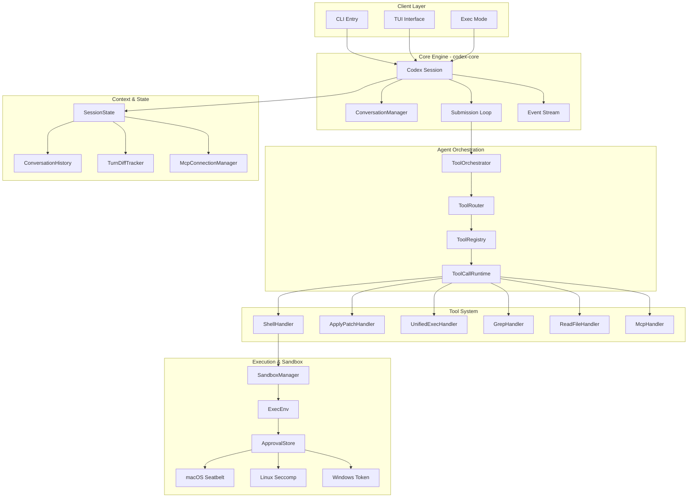
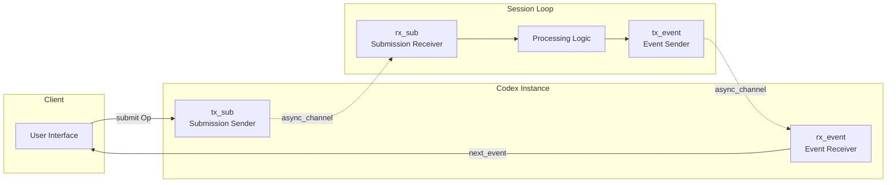
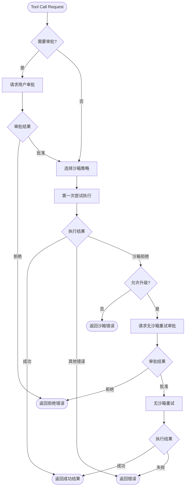
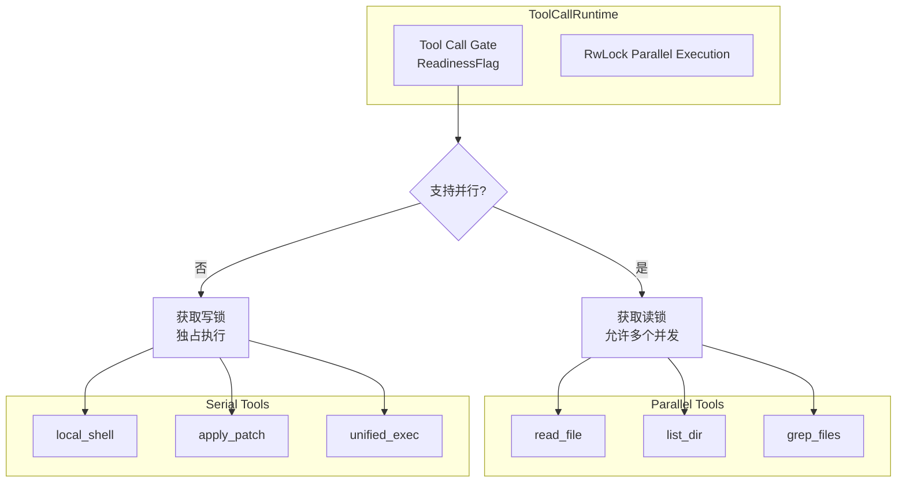
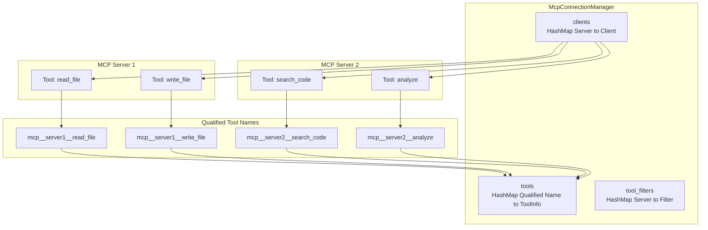
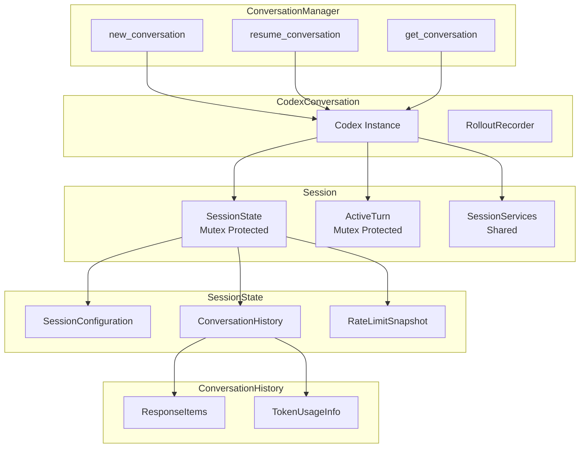
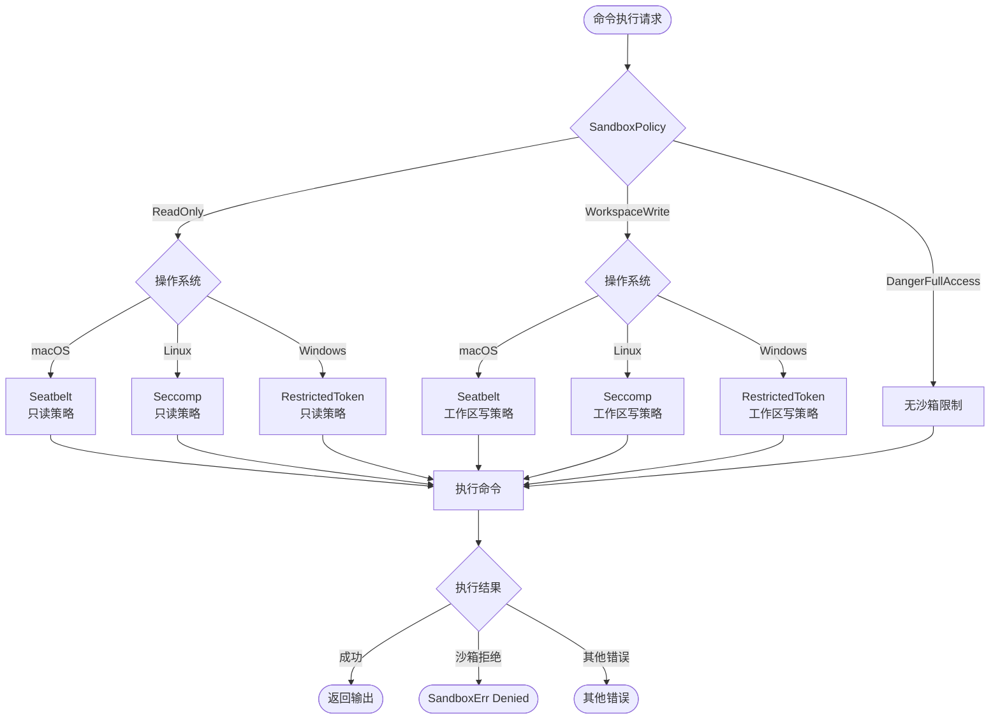
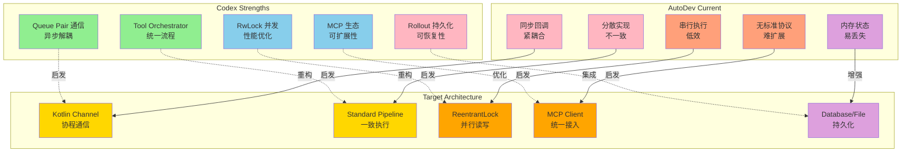

# Codex 架构分析 - 核心图表集

本文件包含 Codex 架构分析的关键 Mermaid 图表，供快速参考。

## 1. 系统架构全景图

## 2. Queue Pair 通信模式

## 3. Tool Orchestrator 执行流程

## 4. 并行工具执行

## 5. MCP 工具管理

## 6. 会话状态管理

## 7. 多层沙箱策略

## 8. 架构对比：Codex vs AutoDev

---

*这些图表对应 [codex-architecture-analysis.md](codex-architecture-analysis.md) 的详细分析内容*
