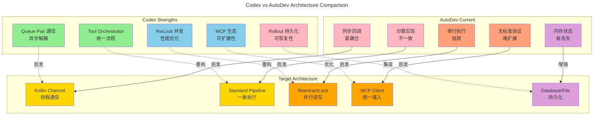
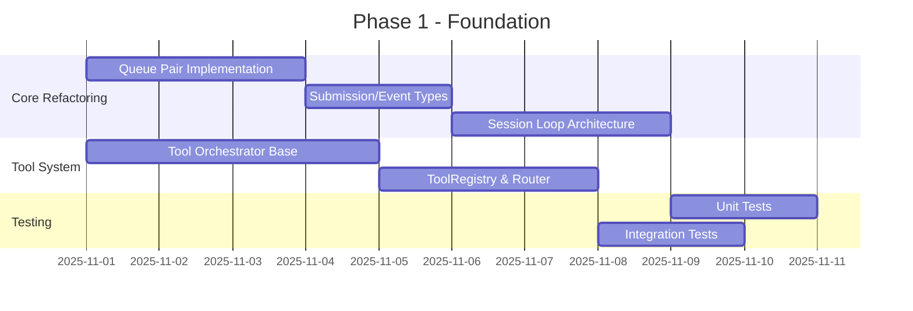
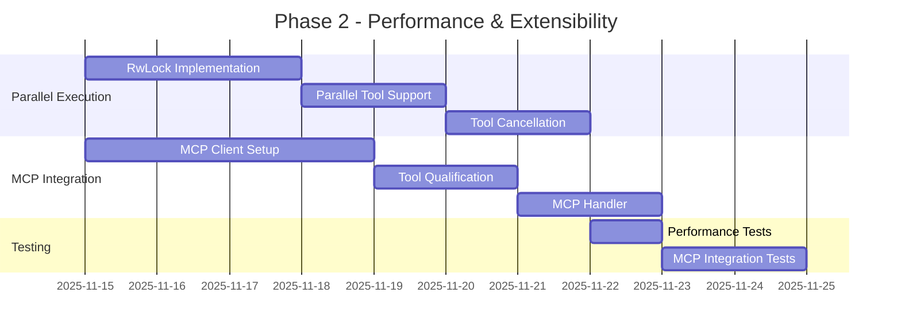
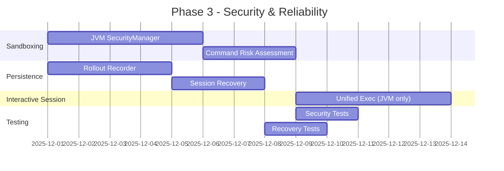

# Codex 架构分析总结

## 📊 核心发现

### 设计模式对比



## 🎯 实现路线图

### Phase 1: Foundation (P0 - 2 weeks)

**Goal**: 建立异步架构基础



**Deliverables**:
- ✅ `CodingAgent` with Queue Pair
- ✅ `ToolOrchestrator` standard flow
- ✅ `SessionState` management
- ✅ Basic tool handlers (Shell, ReadFile, ListDir)

### Phase 2: Performance (P1 - 2 weeks)

**Goal**: 并行执行和 MCP 集成



**Deliverables**:
- ⭐ Parallel tool execution
- ⭐ MCP client integration
- ⭐ Approval flow and risk assessment

### Phase 3: Enhancement (P2 - 3 weeks)

**Goal**: 安全性和可靠性



**Deliverables**:
- 🔧 Basic sandboxing (JVM)
- 🔧 Session persistence
- 🔧 Unified Exec (interactive shell)

## 📈 预期收益

### 性能提升

| 场景 | Current | Target | 提升 |
|------|---------|--------|------|
| 读取 10 个文件 | 串行 ~500ms | 并行 ~100ms | **5x** |
| 执行 5 个搜索 | 串行 ~2s | 并行 ~400ms | **5x** |
| Shell + 文件操作 | 串行 ~800ms | 并发 ~300ms | **2.6x** |

### 代码质量

| 维度 | Current | Target |
|------|---------|--------|
| **可测试性** | ⭐⭐ | ⭐⭐⭐⭐⭐ |
| **可扩展性** | ⭐⭐⭐ | ⭐⭐⭐⭐⭐ |
| **可维护性** | ⭐⭐⭐ | ⭐⭐⭐⭐⭐ |
| **错误恢复** | ⭐⭐ | ⭐⭐⭐⭐ |
| **并发安全** | ⭐⭐ | ⭐⭐⭐⭐⭐ |

### 用户体验

- ✅ **响应更快**: 并行执行减少等待时间
- ✅ **更安全**: 沙箱机制保护系统
- ✅ **更可靠**: 会话持久化防止丢失
- ✅ **更灵活**: MCP 生态快速集成新工具

## 🔑 关键决策

### 1. 通信模式：Queue Pair ✅

**Reason**: 
- UI 和核心逻辑完全解耦
- 易于测试和模拟
- 支持多 UI 前端（CLI、TUI、Web）

**Alternative Rejected**: 
- ❌ 传统回调：紧耦合、难测试
- ❌ Actor 模型：过度复杂

### 2. 工具系统：Orchestrator Pattern ✅

**Reason**:
- 统一审批、沙箱、重试逻辑
- 易于添加新工具
- 清晰的执行流程

**Alternative Rejected**:
- ❌ 每个工具独立实现：代码重复、不一致
- ❌ AOP 切面：隐式逻辑、难调试

### 3. 并发控制：RwLock ✅

**Reason**:
- 读操作真正并行
- 写操作保证数据一致性
- 性能提升显著

**Alternative Rejected**:
- ❌ 全局锁：读操作也串行
- ❌ 无锁：数据竞争风险

### 4. MCP 集成：Client 模式 ✅

**Reason**:
- 标准化工具协议
- 社区生态丰富
- 易于扩展

**Alternative Rejected**:
- ❌ 自定义协议：重复造轮子
- ❌ 插件系统：安全性和隔离性差

## 🚀 Quick Start

### 核心代码示例

```kotlin
// 1. Queue Pair 通信
class CodingAgent {
    private val submissionChannel = Channel<Submission>(64)
    private val eventChannel = Channel<Event>()
    
    suspend fun submit(op: Operation): String {
        val id = generateId()
        submissionChannel.send(Submission(id, op))
        return id
    }
    
    suspend fun nextEvent(): Event = eventChannel.receive()
}

// 2. Tool Orchestrator
class ToolOrchestrator(
    private val sandboxManager: SandboxManager,
    private val approvalStore: ApprovalStore
) {
    suspend fun <Req, Out> run(
        tool: ToolRuntime<Req, Out>,
        request: Req,
        context: ToolContext
    ): Result<Out> {
        // Step 1: Approval
        if (tool.needsApproval(request, context.approvalPolicy)) {
            val decision = approvalStore.requestApproval(tool, request)
            if (decision.isDenied()) return Result.failure("Denied")
        }
        
        // Step 2: Select sandbox
        val sandbox = sandboxManager.select(
            context.sandboxPolicy, 
            tool.sandboxPreference()
        )
        
        // Step 3: First attempt
        val result = tool.run(request, sandbox, context)
        
        // Step 4: Retry without sandbox if denied
        if (result.isSandboxDenied() && tool.canEscalate()) {
            val retryDecision = approvalStore.requestRetryApproval(tool, request)
            if (retryDecision.isApproved()) {
                return tool.run(request, SandboxType.None, context)
            }
        }
        
        return result
    }
}

// 3. Parallel Tool Execution
class ToolCallRuntime {
    private val parallelLock = ReentrantReadWriteLock()
    
    suspend fun execute(tool: Tool, request: Request): Result {
        val lock = if (tool.supportsParallel) {
            parallelLock.readLock()
        } else {
            parallelLock.writeLock()
        }
        
        return withLock(lock) {
            tool.run(request)
        }
    }
}
```

## 📚 深入阅读

- **完整架构分析**: [codex-architecture-analysis.md](codex-architecture-analysis.md)
- **重构实现指南**: [MERGED_DOCUMENTATION.md](../MERGED_DOCUMENTATION.md)
- **Agent 规范**: [AGENTS.md](../AGENTS.md)

---

*分析完成时间: 2025-10-31*  
*分析者: GitHub Copilot + AutoDev Team*  
*基于 Codex commit: latest*
