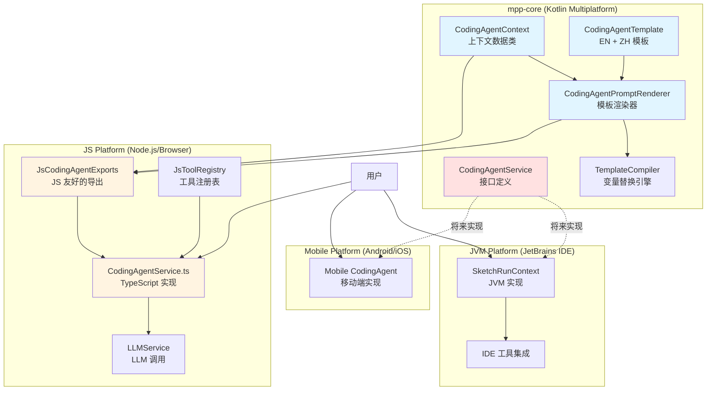
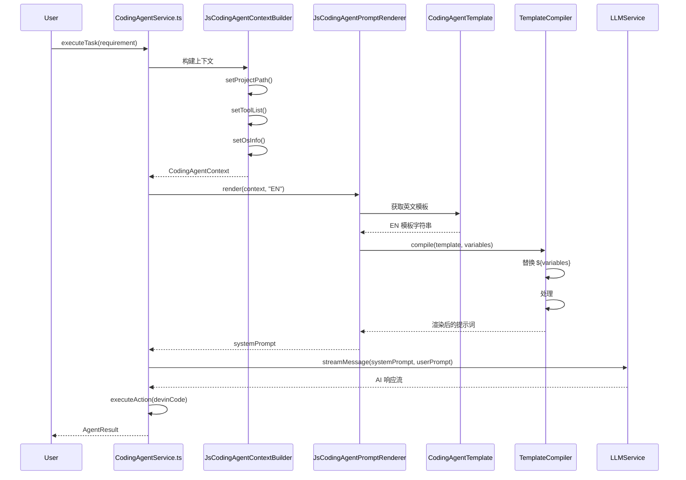

# CodingAgent 架构设计

## 架构图



## 数据流



## 核心组件说明

### 1. CodingAgentContext
**职责**: 收集和管理 Agent 运行所需的所有上下文信息

**主要属性**:
- `projectPath`: 项目路径
- `osInfo`: 操作系统信息
- `timestamp`: 当前时间戳
- `toolList`: 可用工具列表
- `agentRules`: 项目特定规则（AGENTS.md）
- `buildTool`: 构建工具信息
- `frameworkContext`: 框架上下文

**关键方法**:
```kotlin
fun toVariableTable(): VariableTable
```
将上下文转换为模板变量表，供 TemplateCompiler 使用。

### 2. CodingAgentTemplate
**职责**: 定义系统提示词模板

**模板结构**:
```
You are AutoDev...

## Environment Information
- OS: ${osInfo}
- Project Path: ${projectPath}
...

## Available Tools
${toolList}

## Task Execution Guidelines
...

#if (${agentRules})
## Project-Specific Rules
${agentRules}
#end
```

**支持特性**:
- ✅ 变量替换: `${variableName}`
- ✅ 条件语句: `#if (${condition})...#end`
- ✅ 多语言: EN / ZH

### 3. CodingAgentPromptRenderer
**职责**: 渲染模板生成最终提示词

**核心逻辑**:
```kotlin
fun render(context: CodingAgentContext, language: String): String {
    val template = selectTemplate(language)
    val variableTable = context.toVariableTable()
    return TemplateCompiler(variableTable).compile(template)
}
```

### 4. CodingAgentService
**职责**: 定义 Agent 的核心接口

**主要方法**:
- `executeTask(task)`: 执行开发任务
- `buildSystemPrompt(context)`: 构建系统提示词
- `initializeWorkspace(path)`: 初始化工作空间

**设计优势**:
- 接口定义在 mpp-core
- 各平台实现自己的逻辑
- 共享核心提示词生成逻辑

## 跨平台支持

### JavaScript/TypeScript
```typescript
const builder = new JsCodingAgentContextBuilder();
const renderer = new JsCodingAgentPromptRenderer();
const context = builder.setProjectPath("/project").build();
const prompt = renderer.render(context, 'EN');
```

### Kotlin/JVM (未来)
```kotlin
val context = CodingAgentContext.Builder.build(project, requirement)
val renderer = CodingAgentPromptRenderer()
val prompt = renderer.render(context, "EN")
```

### Android/iOS (未来)
```kotlin
// 相同的 API，不同的平台实现
val context = CodingAgentContext(...)
val prompt = CodingAgentPromptRenderer().render(context)
```

## 对比传统方式

### 传统方式（硬编码）
```typescript
buildSystemPrompt() {
  return `You are AutoDev...
OS: ${process.platform}
Project: ${this.projectPath}
...
`;
}
```

**问题**:
- ❌ 每个平台都要实现一遍
- ❌ 提示词分散在各处
- ❌ 难以维护和统一更新
- ❌ 无法动态注入工具

### 新方式（模板 + 上下文）
```typescript
const context = builder.buildContext();
const prompt = renderer.render(context);
```

**优势**:
- ✅ 模板在 mpp-core 统一管理
- ✅ 各平台只需构建上下文
- ✅ 易于维护和更新
- ✅ 支持动态注入

## 扩展性

### 1. 添加新的上下文变量
```kotlin
// 在 CodingAgentContext 中添加
data class CodingAgentContext(
    ...
    val newVariable: String = ""
)

// 在模板中使用
## New Section
${newVariable}
```

### 2. 添加新的工具
```kotlin
// 工具会自动通过 ToolRegistry 注入
val tools = toolRegistry.getAgentTools()
val toolList = formatTools(tools)
```

### 3. 添加新的语言
```kotlin
object CodingAgentTemplate {
    const val EN = "..."
    const val ZH = "..."
    const val JA = "..."  // 日文
    const val KO = "..."  // 韩文
}
```

## 总结

新的架构设计实现了：

1. **统一的抽象层** - 所有平台共享相同的接口
2. **模板化管理** - 提示词集中管理，易于维护
3. **跨平台支持** - 一次实现，多平台复用
4. **动态配置** - 支持工具和上下文的动态注入
5. **可扩展性** - 易于添加新变量、新工具、新语言

这是一个可持续发展的架构，为未来的扩展奠定了坚实的基础。

