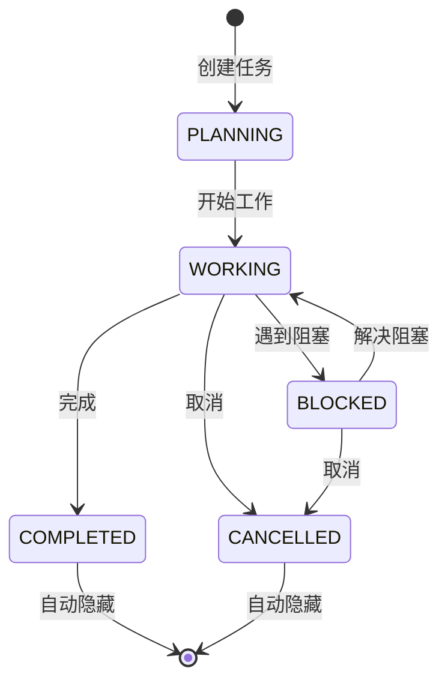

# Task Panel 功能

## 概述

Task Panel 是一个新的 UI 组件，用于在 AgentChatInterface 中实时展示通过 `task-boundary` 工具创建的任务状态。当 Agent 执行复杂任务时，可以通过 `task-boundary` 工具来声明任务边界和状态，这些信息会自动显示在 Task Panel 中。

## 功能特性

### 1. 自动显示/隐藏
- 当有活跃任务（非 COMPLETED/CANCELLED 状态）时，Task Panel 自动显示
- 没有活跃任务时，Task Panel 自动隐藏，保持界面整洁

### 2. 任务状态跟踪
支持 5 种任务状态：
- **PLANNING** (规划中) - 紫色，带规划图标
- **WORKING** (工作中) - 蓝色，带旋转动画图标
- **COMPLETED** (已完成) - 绿色，带完成图标
- **BLOCKED** (阻塞) - 橙色，带警告图标
- **CANCELLED** (已取消) - 灰色，带取消图标

### 3. 任务信息展示
每个任务卡片显示：
- 任务状态徽章（彩色背景 + 图标）
- 任务名称（粗体）
- 任务摘要（描述当前活动）
- 任务执行时间（从创建开始计时）

### 4. 响应式布局
- **有任务时**: AgentMessageList (65%) + TaskPanel (35%)
- **无任务时**: AgentMessageList (100%)
- 在 TreeView 显示和隐藏状态下均适用

## 实现架构

### 1. 数据流
```
ToolOrchestrator (task-boundary 调用)
    ↓
ComposeRenderer.renderToolCall()
    ↓
ComposeRenderer.updateTaskFromToolCall()
    ↓
ComposeRenderer._tasks (mutableStateListOf)
    ↓
AgentChatInterface (observe tasks)
    ↓
TaskPanel (UI 渲染)
```

### 2. 核心组件

#### TaskPanel.kt
- `TaskInfo`: 任务数据模型
- `TaskStatus`: 任务状态枚举
- `TaskPanel`: 主面板组件
- `TaskCard`: 单个任务卡片组件

#### ComposeRenderer.kt
- `_tasks`: 任务状态列表
- `updateTaskFromToolCall()`: 从工具调用更新任务
- 任务去重逻辑：相同 taskName 更新，不同 taskName 新增

#### AgentChatInterface.kt
- 观察 `viewModel.renderer.tasks`
- 过滤活跃任务（非 COMPLETED/CANCELLED）
- 根据任务列表动态调整布局

### 3. 任务生命周期



## 使用示例

### Agent 端使用

在 CodingAgent 中使用 task-boundary 工具：

```kotlin
// 规划阶段
/task-boundary taskName="实现用户认证" status="PLANNING" summary="分析现有代码结构，规划 OAuth2 实现方案"

// 工作阶段
/task-boundary taskName="实现用户认证" status="WORKING" summary="正在实现 OAuth2 登录流程"

// 完成阶段
/task-boundary taskName="实现用户认证" status="COMPLETED" summary="OAuth2 认证已实现并测试通过"
```

### CLI 测试

```bash
cd mpp-ui && node dist/index.js code --path /path/to/project --task "Create a complex feature"
```

LLM 会在执行复杂任务时自动使用 task-boundary 工具来报告进度。

## UI 效果

### 任务卡片样式
- 圆角卡片，带状态色彩背景（8% 透明度）
- 左上角状态徽章（15% 透明度背景 + 状态图标/圆点）
- 右上角显示执行时间（动态更新）
- WORKING 状态显示旋转动画图标

### 空状态
当没有任务时，显示：
- 大号完成图标（灰色）
- "No active tasks" 文本

## 配置要求

### mcp.json 配置
确保 `~/.autodev/mcp.json` 中启用了 task-boundary 工具：

```json
{
  "enabledBuiltinTools": [
    "read-file",
    "write-file",
    "edit-file",
    "grep",
    "glob",
    "shell",
    "ask-agent",
    "task-boundary"
  ]
}
```

## 技术细节

### 状态管理
- 使用 `mutableStateListOf<TaskInfo>()` 实现响应式任务列表
- 通过 `remember(viewModel.renderer.tasks)` 观察任务变化
- 相同 taskName 的任务会被更新而非新增

### 动画效果
- WORKING 状态的图标使用 `rememberInfiniteTransition()` 实现旋转动画
- 2 秒完成 360 度旋转，循环播放

### 时间格式化
```kotlin
private fun formatDuration(seconds: Long): String {
    return when {
        seconds < 60 -> "${seconds}s"
        seconds < 3600 -> "${seconds / 60}m ${seconds % 60}s"
        else -> "${seconds / 3600}h ${(seconds % 3600) / 60}m"
    }
}
```

## 未来优化方向

1. **任务历史**: 添加查看已完成任务的历史记录
2. **任务过滤**: 按状态筛选任务
3. **任务搜索**: 搜索特定任务
4. **任务统计**: 显示任务完成率、平均时间等
5. **任务导出**: 导出任务列表为 Markdown/JSON
6. **任务通知**: 任务状态变化时的通知提示
7. **子任务支持**: 支持任务的层级结构

## 相关文件

- `mpp-ui/src/commonMain/kotlin/cc/unitmesh/devins/ui/compose/agent/TaskPanel.kt` - Task Panel 组件
- `mpp-ui/src/commonMain/kotlin/cc/unitmesh/devins/ui/compose/agent/ComposeRenderer.kt` - 任务状态管理
- `mpp-ui/src/commonMain/kotlin/cc/unitmesh/devins/ui/compose/agent/AgentChatInterface.kt` - Task Panel 集成
- `mpp-core/src/commonMain/kotlin/cc/unitmesh/agent/tool/impl/TaskBoundaryTool.kt` - task-boundary 工具定义
- `mpp-core/src/commonMain/kotlin/cc/unitmesh/agent/CodingAgentTemplate.kt` - Agent 提示词（引导使用 task-boundary）

