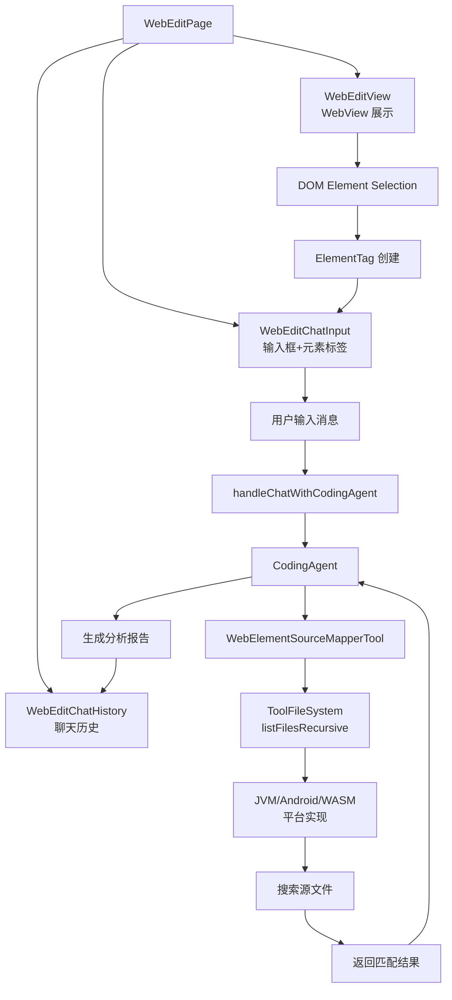

# WebEdit DOM Inspection with CodingAgent Integration

## Overview

实现了一个完整的 DOM 元素检查和 AI 分析功能，当用户通过 Inspect DOM 功能选择 DOM 元素时，Agent 可以自动分析元素并提供源代码映射建议。

## 功能特性

### 1. DOM 元素标签系统（ElementTag）
- **自动标签创建**：选择 DOM 元素时自动创建带有元素信息的标签（tag-like UI）
- **标签展示**：使用 Chip 样式展示元素标签，包含图标和元素摘要信息
- **查看详情**：点击标签上的 ℹ️ 图标，将完整的 HTML 代码和所有属性添加到聊天历史中
- **双击移除**：双击标签即可移除
- **LLM 上下文生成**：自动将元素信息格式化为适合 LLM 理解的上下文

#### 详情显示功能
点击 ℹ️ 图标后，在聊天历史中显示：
```markdown
### 📋 Element Details

**HTML Code:**
```html
<button class="clean-btn toCollapsibleButton_TOQP">
  改为英语
</button>
```

**Tag Name:** `<button>`

**CSS Selector:** `button.clean-btn.toCollapsibleButton_TOQP`

**Attributes:**
- `class` = `"clean-btn toCollapsibleButton_TOQP"`

**Text Content:** "改为英语"

**💡 Source Location Hint:**
> 可能是 React 组件: ToCollapsibleButton (基于类名 toCollapsibleButton_TOQP)
```

**优势：**
- ✅ 信息保留在聊天历史中，方便对比和查阅
- ✅ 可以复制 HTML 代码
- ✅ Markdown 格式美观易读
- ✅ 包含源码定位提示

### 2. 源代码映射工具（WebElementSourceMapperTool）
CodingAgent 可以使用此工具将 DOM 元素映射到项目源代码：

#### 支持的框架检测
- React (`.jsx`, `.tsx`)
- Vue (`.vue`)
- Angular (`.component.ts`, `.html`)
- Svelte (`.svelte`)
- HTML (`.html`, `.htm`)

#### 6 种搜索模式
1. **className 搜索**：`className="button-primary"`
2. **id 搜索**：`id="submit-btn"`
3. **data 属性搜索**：`data-testid="login-button"`
4. **BEM 命名约定**：`class="block__element--modifier"`
5. **组件名搜索**（React/Vue）：`<Button>`, `Button.jsx`
6. **标签+类名组合**：`<button class="primary">`

#### 搜索优先级
- 先搜索组件文件（`.jsx`, `.tsx`, `.vue`, `.svelte`）
- 再搜索模板文件（`.html`, `.htm`）
- 最后搜索样式文件（如果需要）

### 3. 聊天历史展示（WebEditChatHistory）
- **消息列表**：展示用户和 Assistant 的对话历史
- **自动滚动**：新消息到达时自动滚动到底部
- **Markdown 渲染**：Assistant 的回复使用 MarkdownSketchRenderer 渲染，支持代码块、列表等
- **角色区分**：
  - 用户消息：primaryContainer 背景，右对齐
  - Assistant 消息：secondaryContainer 背景，左对齐
- **可折叠面板**：左侧 400dp 宽度，可通过关闭按钮隐藏

### 4. CodingAgent 集成
- **上下文感知**：自动将页面 URL、标题、选中的 DOM 元素信息传递给 Agent
- **智能分析**：Agent 可以：
  1. 分析 DOM 元素信息
  2. 搜索项目中对应的源文件
  3. 识别渲染这些元素的组件/模板/代码
  4. 如果用户请求修改，建议或应用更改
- **实时响应**：Agent 的分析结果实时显示在聊天历史中

## 技术实现

### 数据模型

```kotlin
// ElementTag.kt
data class ElementTag(
    val tagName: String,
    val id: String?,
    val className: String?,
    val attributes: Map<String, String>,
    val textContent: String?,
    val xpath: String?
)

data class ElementTagCollection(
    val tags: List<ElementTag>
) {
    fun toLLMContext(): String
    fun toSourceMappingPrompt(): String
}

// ChatMessage.kt
data class ChatMessage(
    val role: String, // "user" or "assistant"
    val content: String
)
```

### UI 组件

```kotlin
// WebEditChatInput.kt - 输入框带元素标签
@Composable
fun ElementTagChip(
    tag: ElementTag,
    onRemove: () -> Unit
)

// WebEditChatHistory.kt - 聊天历史展示
@Composable
fun WebEditChatHistory(
    messages: List<ChatMessage>,
    modifier: Modifier = Modifier,
    onClose: () -> Unit = {}
)

// WebEditPage.kt - 主页面集成
@Composable
fun WebEditPage(
    llmService: KoogLLMService?,
    codingAgent: CodingAgent?,
    projectPath: String = "",
    ...
)
```

### CodingAgent 工具

```kotlin
// WebElementSourceMapperTool.kt
class WebElementSourceMapperTool(
    private val fileSystem: ToolFileSystem
) : ExecutableTool() {
    override fun execute(params: ToolCallParams): ToolExecuteResult
    
    private fun detectFramework(projectPath: String): Framework
    private fun buildSearchPatterns(element: ElementInfo): List<SearchPattern>
    private fun searchForPattern(pattern: SearchPattern, files: List<String>): List<FileMatch>
}
```

### 跨平台文件系统支持

为支持 WebElementSourceMapperTool 的文件搜索功能，在所有平台实现了 `listFilesRecursive` 方法：

#### JVM 平台（DefaultToolFileSystem）
```kotlin
override fun listFilesRecursive(path: String, maxDepth: Int): List<String> {
    return collectFilesRecursive(Path(path), maxDepth = maxDepth)
}

private fun collectFilesRecursive(
    path: Path,
    depth: Int = 0,
    maxDepth: Int = 5
): List<String>
```

#### Android 平台（AndroidToolFileSystem）
```kotlin
override fun listFilesRecursive(path: String, maxDepth: Int): List<String> {
    // 支持 content:// URI 和常规文件路径
    return if (path.startsWith("content://")) {
        collectFilesFromContentUri(Uri.parse(path), maxDepth)
    } else {
        collectFilesRecursive(File(path), maxDepth = maxDepth)
    }
}
```

#### WASM-JS 平台（WasmJsToolFileSystem）
```kotlin
override fun listFilesRecursive(path: String, maxDepth: Int): List<String> {
    // 遍历内存文件系统树
    return collectFilesRecursive(root, path, maxDepth = maxDepth)
}

private fun collectFilesRecursive(
    node: MemoryFSNode,
    basePath: String,
    depth: Int = 0,
    maxDepth: Int = 5
): List<String>
```

## 使用流程

1. **打开 WebEdit 页面**
   - 输入 URL 并加载网页

2. **启用选择模式**
   - 点击 "Selection Mode" 按钮

3. **选择 DOM 元素**
   - 在网页中点击要分析的元素
   - 自动创建元素标签显示在输入框上方
   - 点击标签上的 **ℹ️ 图标**查看完整的 HTML 代码和所有属性信息

4. **查看元素详情**（可选）
   - **HTML Code**: 查看完整的元素 HTML 结构
   - **Attributes**: 查看所有属性（id, class, data-* 等）
   - **Source Hint**: 查看推测的源代码位置
   - 这些信息帮助你快速定位 React/Vue/Angular 组件源码

5. **输入分析请求**
   - 在输入框中输入问题或请求，例如：
     - "这个按钮在哪个文件中定义？"
     - "帮我修改这个按钮的文字"
     - "这个元素的样式在哪里定义的？"

6. **查看 Agent 分析结果**
   - 左侧聊天面板自动展开
   - 显示 Agent 的分析结果、文件位置、代码建议等

7. **继续对话**
   - 可以继续追问或提出新的修改请求
   - 历史对话保留在聊天面板中

## 工具注册

在 `BuiltinToolsProvider.kt` 中已注册：

```kotlin
private val builtinTools = listOf(
    // ... 其他工具
    WebElementSourceMapperTool::class,
    // ...
)
```

## 测试

编译测试通过的平台：
- ✅ JVM (`./gradlew :mpp-ui:compileKotlinJvm`)
- ✅ Android (`./gradlew :mpp-ui:compileDebugKotlinAndroid`)
- ✅ WASM-JS (`./gradlew :mpp-ui:compileKotlinWasmJs`)

## 示例对话

**User:** 
这个提交按钮在哪个文件中？

**Assistant:**
我找到了这个提交按钮的定义：

**文件位置：** `src/components/LoginForm.tsx`

**代码片段：**
```tsx
<button 
  className="submit-button primary"
  type="submit"
  onClick={handleSubmit}
>
  Submit
</button>
```

**相关文件：**
- 组件：`src/components/LoginForm.tsx` (第 45-52 行)
- 样式：`src/styles/button.css` (`.submit-button` 定义)
- 类型：`src/types/form.ts` (表单类型定义)

您需要修改这个按钮吗？

## 未来改进方向

1. **实时预览**：修改源代码后实时刷新 WebView 预览
2. **批量选择**：支持同时选择多个元素进行批量操作
3. **样式分析**：深度分析 CSS 样式来源和级联关系
4. **组件树视图**：显示 React/Vue 组件层级关系
5. **历史记录持久化**：保存聊天历史到数据库
6. **代码直接编辑**：在聊天界面中直接修改和应用代码更改

## 相关文件

### 新增文件
- `mpp-ui/src/commonMain/kotlin/cc/unitmesh/devins/ui/compose/agent/webedit/ElementTag.kt`
- `mpp-ui/src/commonMain/kotlin/cc/unitmesh/devins/ui/compose/agent/webedit/WebEditChatHistory.kt`
- `mpp-core/src/commonMain/kotlin/cc/unitmesh/devins/agent/tools/WebElementSourceMapperTool.kt`

### 修改文件
- `mpp-ui/src/commonMain/kotlin/cc/unitmesh/devins/ui/compose/agent/webedit/WebEditPage.kt`
- `mpp-ui/src/commonMain/kotlin/cc/unitmesh/devins/ui/compose/agent/webedit/WebEditChatInput.kt`
- `mpp-core/src/commonMain/kotlin/cc/unitmesh/devins/filesystem/ToolFileSystem.kt`
- `mpp-core/src/jvmMain/kotlin/cc/unitmesh/devins/filesystem/DefaultToolFileSystem.kt`
- `mpp-core/src/androidMain/kotlin/cc/unitmesh/devins/filesystem/AndroidToolFileSystem.kt`
- `mpp-core/src/wasmJsMain/kotlin/cc/unitmesh/devins/filesystem/WasmJsToolFileSystem.kt`
- `mpp-core/src/commonMain/kotlin/cc/unitmesh/devins/agent/tools/BuiltinToolsProvider.kt`

## 架构图


