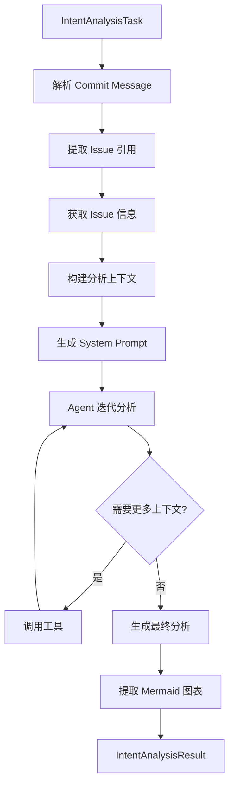

# Intent Analysis Feature - Implementation Summary

## 完成的功能

我已经成功在 `CodeReviewAgent` 中添加了新的意图分析功能，具有以下特点：

### 1. 核心功能

✅ **新数据类型**:
- `IntentAnalysisTask`: 包含 commit message, code changes, commit id, issue tracker 信息
- `IssueInfo`: Issue/PR 信息结构
- `IntentAnalysisContext`: 意图分析上下文
- `IntentAnalysisResult`: 分析结果（包含 mermaid 图表）

✅ **新方法 - `analyzeIntentWithTools()`**:
- Tool-driven approach（类似原来的 CodeReviewAgentTemplate）
- Agent 可以动态选择文件进行分析
- 支持 issue 信息获取和推理
- 生成 mermaid 图表展示用户意图
- 评估实现准确性
- 提供改进建议

✅ **Commit Message 解析**:
- 支持多种格式：`#123`, `GH-123`, `fixes #123`, `closes #456`
- 自动提取 issue 引用

✅ **Prompt Templates**:
- `IntentAnalysisTemplate.EN`: 英文版本
- `IntentAnalysisTemplate.ZH`: 中文版本
- 详细的分析流程指导
- 结构化输出格式

### 2. 与 `analyzeWithDataDriven` 的对比

| 特性 | `analyzeIntentWithTools` (新) | `analyzeWithDataDriven` (已有) |
|------|------------------------------|--------------------------------|
| 方法 | Tool-driven (Agent 驱动) | Data-driven (数据驱动) |
| 上下文收集 | 动态按需 | 预先收集 |
| 工具使用 | ✅ 是 | ❌ 否 |
| 迭代次数 | 多次 (最多 10 次) | 单次 |
| Mermaid 图表 | ✅ 是 | ❌ 否 |
| Issue 集成 | ✅ 是 | ❌ 否 |
| 意图推理 | ✅ 是 | ❌ 否 |
| 实现评估 | ✅ 是 | ❌ 否 |

### 3. 工作流程



### 4. 使用示例

```kotlin
// 创建任务
val task = IntentAnalysisTask(
    commitMessage = "feat: Add user auth #123\n\nCloses #123",
    commitId = "abc123",
    codeChanges = mapOf("src/Auth.kt" to "diff..."),
    projectPath = "/path/to/project"
)

// 执行分析
val result = codeReviewAgent.analyzeIntentWithTools(
    task = task,
    language = "ZH",  // 或 "EN"
    onProgress = { println(it) }
)

// 处理结果
println(result.analysis)
println(result.mermaidDiagram)
```

### 5. 输出格式

Agent 会生成结构化的分析，包括：

- 🎯 **意图总结**: 简要概述开发者意图
- 🔍 **详细分析**: 主要目标、相关 issue、实现方法
- 📊 **意图流程图**: Mermaid 图表可视化
- ✅ **实现评估**: 准确性、完整性、发现的问题、改进建议
- 💡 **其他见解**: 额外的观察和建议

### 6. 技术实现

**文件修改**:
- `CodeReviewAgent.kt`: 添加了新方法和数据类
- `CodeReviewAgentPromptRenderer.kt`: 添加了新的 prompt templates

**关键方法**:
- `analyzeIntentWithTools()`: 主入口
- `parseIssueReferences()`: 解析 issue 引用
- `fetchIssueInfo()`: 获取 issue 信息（待实现真实 API）
- `buildIntentAnalysisContext()`: 构建分析上下文
- `executeIntentAnalysis()`: 执行 tool-driven 分析
- `extractMermaidDiagram()`: 提取 mermaid 图表

### 7. 未来改进

需要完成的事项：

1. **Issue Tracker 集成**: 
   - 当前使用占位数据
   - 需要实现真实的 GitHub/GitLab API 调用

2. **准确性评分**:
   - 实现自动化的准确性评分算法
   - 基于代码分析和 issue 描述的匹配度

3. **建议生成**:
   - 自动化的改进建议生成
   - 基于最佳实践和常见模式

## 编译状态

✅ **编译成功**: 
- JVM platform: ✅
- JS platform: ✅ (应该也可以)

⚠️ **已知问题**:
- WASM platform 有已存在的 Gradle 配置问题（与本次修改无关）

## 文档

- ✅ 创建了详细的使用指南: `docs/intent-analysis-usage.md`
- ✅ 创建了实现总结: 本文档

## 总结

成功实现了基于 commit message + code change + issue 信息的意图分析功能：

- ✅ Tool-driven 方法（Agent 可以动态选择文件）
- ✅ Issue 引用解析和信息获取
- ✅ 用户意图推理
- ✅ Mermaid 图表可视化
- ✅ 实现准确性评估
- ✅ 双语支持 (EN/ZH)
- ✅ 与现有的 `analyzeWithDataDriven` 方法并存

这个新功能让用户能够更深入地理解代码变更背后的意图，并评估实现是否准确，还能获得改进建议。

