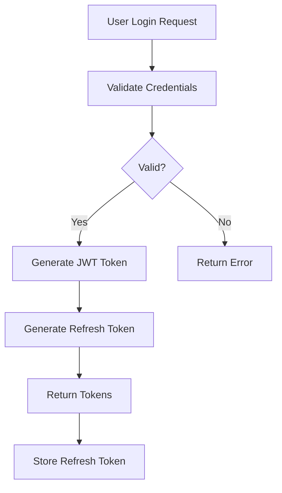

# Intent Analysis Feature - Usage Guide

## Overview

The new Intent Analysis feature allows you to analyze commits and understand the developer's intent behind code changes. It uses a tool-driven approach where the AI agent can dynamically gather information to perform comprehensive analysis.

## Key Features

- **Commit Message Parsing**: Automatically extracts issue/PR references (e.g., #123, GH-456, fixes #789)
- **Issue Integration**: Fetches issue information from issue trackers (GitHub/GitLab)
- **Tool-Driven Analysis**: Agent can use tools (read-file, grep, etc.) to gather context
- **Mermaid Visualization**: Generates mermaid diagrams to visualize user intent and implementation flow
- **Implementation Evaluation**: Assesses whether the implementation matches the stated intent
- **Bilingual Support**: English and Chinese prompts

## Usage Example

### 1. Create an Intent Analysis Task

```kotlin
import cc.unitmesh.agent.IntentAnalysisTask

val task = IntentAnalysisTask(
    commitMessage = """
        feat: Add user authentication system #123
        
        Implements JWT-based authentication with refresh tokens.
        Closes #123
    """.trimIndent(),
    commitId = "abc123def",
    codeChanges = mapOf(
        "src/auth/AuthService.kt" to """
            @@ -0,0 +1,50 @@
            +class AuthService(private val jwtService: JwtService) {
            +    fun authenticate(credentials: Credentials): AuthResult {
            +        // Implementation
            +    }
            +}
        """.trimIndent()
    ),
    projectPath = "/path/to/project",
    issueTrackerType = "github",
    issueTrackerUrl = "https://github.com/org/repo",
    issueToken = "your_token_here"
)
```

### 2. Analyze Intent

```kotlin
import cc.unitmesh.agent.CodeReviewAgent

// Assuming you have initialized CodeReviewAgent
val result = codeReviewAgent.analyzeIntentWithTools(
    task = task,
    language = "EN", // or "ZH" for Chinese
    onProgress = { message ->
        println(message)
    }
)
```

### 3. Process Results

```kotlin
if (result.success) {
    println("Analysis:")
    println(result.analysis)
    
    // Extract mermaid diagram
    result.mermaidDiagram?.let { diagram ->
        println("\nMermaid Diagram:")
        println(diagram)
    }
    
    println("\nIssues Analyzed: ${result.issuesAnalyzed.joinToString(", ")}")
    println("Implementation Accuracy: ${result.implementationAccuracy}")
    
    if (result.suggestedImprovements.isNotEmpty()) {
        println("\nSuggested Improvements:")
        result.suggestedImprovements.forEach { improvement ->
            println("- $improvement")
        }
    }
}
```

## How It Works

### Tool-Driven Approach

Unlike the data-driven `analyzeWithDataDriven` method (which analyzes pre-collected data in a single pass), `analyzeIntentWithTools` uses a tool-driven approach:

1. **Initial Analysis**: The agent receives commit information and code changes
2. **Dynamic Tool Usage**: The agent can use tools to:
   - Read relevant source files
   - Search for related code patterns
   - Read test files to understand expected behavior
   - Gather additional context as needed
3. **Iterative Process**: The agent continues gathering information until it has enough context
4. **Final Output**: Generates comprehensive analysis with mermaid visualization

### Example Output Structure

The agent will produce output following this structure:

```markdown
### 🎯 Intent Summary
The developer intended to implement a JWT-based authentication system to address security requirements in issue #123.

### 🔍 Detailed Analysis
- **Primary Goal**: Implement secure user authentication with JWT tokens
- **Related Issues**: Issue #123 requests OAuth2 support, but JWT was chosen for simplicity
- **Implementation Approach**: Uses refresh token pattern with token rotation

### 📊 Intent Flow Diagram


### ✅ Implementation Evaluation
- **Accuracy**: High - Code matches the intent
- **Completeness**: Partial - Missing token expiration handling
- **Issues Found**:
  - Token expiration not implemented in AuthService.kt:25
  - Refresh token rotation not implemented
- **Suggested Improvements**:
  - Add token expiration validation
  - Implement refresh token rotation for better security
  - Add rate limiting to prevent brute force attacks

### 💡 Additional Insights
Consider adding integration tests for the authentication flow.
```

## Comparison with Data-Driven Analysis

| Feature | `analyzeIntentWithTools` | `analyzeWithDataDriven` |
|---------|-------------------------|------------------------|
| Approach | Tool-driven (agentic) | Data-driven (single-pass) |
| Context Gathering | Dynamic, on-demand | Pre-collected |
| Tool Usage | Yes | No |
| Iterations | Multiple (up to 10) | Single |
| Best For | Intent analysis, exploration | Quick review with known data |
| Mermaid Diagrams | Yes | No |
| Issue Integration | Yes | No |

## Advanced Configuration

### Custom Issue Tracker Integration

You can implement custom issue fetching by extending the `fetchIssueInfo` method (currently uses placeholder data):

```kotlin
// TODO: Implement actual issue tracker integration
// This would call GitHub/GitLab API based on issueTrackerType
```

### Customizing the Analysis Process

The intent analysis prompt can be customized by modifying the `IntentAnalysisTemplate` in `CodeReviewAgentPromptRenderer.kt`:

```kotlin
object IntentAnalysisTemplate {
    val EN = """
    # Your custom prompt template
    ...
    """
}
```

## Limitations

1. **Issue Tracker Integration**: Currently uses placeholder data. Real GitHub/GitLab integration needs to be implemented.
2. **Iteration Limit**: Maximum 10 iterations to prevent infinite loops.
3. **Token Usage**: Tool-driven approach uses more tokens than data-driven.

## Future Enhancements

- [ ] Implement real GitHub/GitLab API integration
- [ ] Add support for more issue trackers (Jira, Linear, etc.)
- [ ] Implement accuracy scoring algorithm
- [ ] Add automated improvement suggestions
- [ ] Support for analyzing multiple commits
- [ ] Git history analysis integration

## See Also

- `CodeReviewAgent.kt` - Main agent implementation
- `CodeReviewAgentPromptRenderer.kt` - Prompt templates
- `analyzeWithDataDriven()` - Data-driven analysis method

