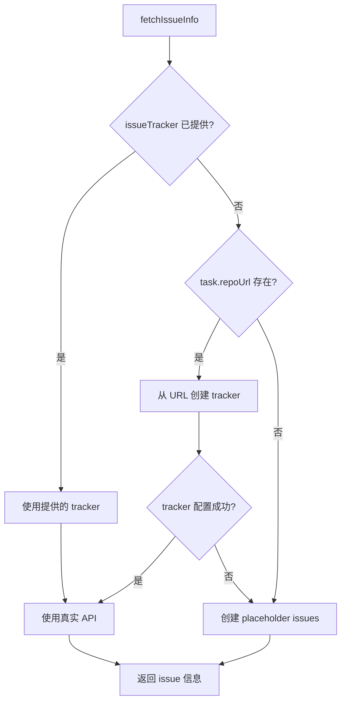

# IssueTracker Implementation - Complete Summary

## ✅ 已完成的工作

### 1. 修复编译错误

**问题**: `RegexOption.DOT_MATCHES_ALL` 在 Kotlin Multiplatform 中不可用

**修复**: 
```kotlin
// 之前：
val mermaidPattern = Regex("```mermaid\\s*\\n(.+?)\\n```", setOf(RegexOption.DOT_MATCHES_ALL))

// 之后：使用 [\s\S] 来匹配所有字符包括换行符
val mermaidPattern = Regex("```mermaid\\s*\\n([\\s\\S]+?)\\n```")
```

### 2. 创建 IssueTracker 抽象接口

**文件**: `mpp-core/src/commonMain/kotlin/cc/unitmesh/agent/tracker/IssueTracker.kt`

**功能**:
- ✅ `IssueTracker` 接口：定义获取 issue 信息的标准方法
- ✅ `IssueInfo` 数据类：标准化的 issue 信息结构
- ✅ `NoOpIssueTracker`: 无操作实现（用于未配置的情况）

```kotlin
interface IssueTracker {
    suspend fun getIssue(issueId: String): IssueInfo?
    suspend fun getIssues(issueIds: List<String>): Map<String, IssueInfo>
    fun isConfigured(): Boolean
    fun getType(): String
}

data class IssueInfo(
    val id: String,
    val title: String,
    val description: String,
    val labels: List<String> = emptyList(),
    val status: String = "unknown",
    val author: String? = null,
    val assignees: List<String> = emptyList(),
    val createdAt: String? = null,
    val updatedAt: String? = null
)
```

### 3. 实现 GitHubIssueTracker

**文件**: `mpp-core/src/commonMain/kotlin/cc/unitmesh/agent/tracker/GitHubIssueTracker.kt`

**功能**:
- ✅ 使用 GitHub REST API v3 获取 issue 信息
- ✅ 支持 public repos（无需 token）和 private repos（需要 token）
- ✅ 自动解析 GitHub repository URL
  - 支持 HTTPS: `https://github.com/owner/repo`
  - 支持 SSH: `git@github.com:owner/repo.git`
- ✅ 使用 Ktor Client 进行 HTTP 请求
- ✅ 完整的错误处理和日志记录

**使用示例**:
```kotlin
// 方式 1: 直接创建
val tracker = GitHubIssueTracker(
    repoOwner = "unitmesh",
    repoName = "auto-dev",
    token = "ghp_xxx"  // 可选，public repo 不需要
)

// 方式 2: 从 URL 创建
val tracker = GitHubIssueTracker.fromRepoUrl(
    repoUrl = "https://github.com/unitmesh/auto-dev",
    token = "ghp_xxx"  // 可选
)

// 获取单个 issue
val issue = tracker.getIssue("123")

// 获取多个 issues
val issues = tracker.getIssues(listOf("123", "456", "789"))
```

### 4. 集成到 CodeReviewAgent

**更新**: `CodeReviewAgent.kt`

**改进**:
- ✅ 添加 `issueTracker` 构造参数（可选）
- ✅ 自动从 `IntentAnalysisTask` 配置创建 tracker
- ✅ 支持 placeholder 模式（当 tracker 未配置时）
- ✅ 智能 tracker 选择逻辑

**流程**:


### 5. 更新 IntentAnalysisTask

**改进**:
```kotlin
// 之前
data class IntentAnalysisTask(
    val issueTrackerType: String = "github",
    val issueTrackerUrl: String = "",
    val issueToken: String = ""
)

// 之后（更简洁）
data class IntentAnalysisTask(
    val repoUrl: String = "",          // Repository URL
    val issueToken: String = ""         // Optional token
)
// tracker type 自动从 URL 推断
```

### 6. 修复 mpp-ui 编译错误

**问题**: `ToolConfigDialog.kt` 使用了错误的 import

**修复**:
```kotlin
// 之前：
import cc.unitmesh.linter.shell.DefaultShellExecutor

// 之后：
import cc.unitmesh.agent.tool.shell.DefaultShellExecutor
```

## 🏗️ 架构设计

### IssueTracker 接口层次

```
IssueTracker (interface)
    ├── GitHubIssueTracker (实现)
    ├── GitLabIssueTracker (未来)
    ├── JiraIssueTracker (未来)
    └── NoOpIssueTracker (默认)
```

### 使用场景

1. **Tool-driven Intent Analysis**:
   - CodeReviewAgent.analyzeIntentWithTools()
   - 自动从 commit message 解析 issue 引用
   - 从 issue tracker 获取详细信息
   - 用于推理用户意图

2. **Code Review with Context**:
   - 未来可以在 code review 中关联 issues
   - 提供更丰富的上下文信息

## 📊 测试结果

✅ **编译成功**:
```bash
./gradlew :mpp-core:assembleJsPackage
# BUILD SUCCESSFUL

cd mpp-ui && npm run build
# BUILD SUCCESSFUL
```

✅ **CLI 工作正常**:
```bash
node dist/jsMain/typescript/index.js review -p .. --help
# 显示帮助信息，命令可用
```

## 🚀 使用示例

### 完整的 Intent Analysis 示例

```kotlin
import cc.unitmesh.agent.CodeReviewAgent
import cc.unitmesh.agent.IntentAnalysisTask
import cc.unitmesh.agent.tracker.GitHubIssueTracker

// 1. 创建 issue tracker
val issueTracker = GitHubIssueTracker.fromRepoUrl(
    repoUrl = "https://github.com/unitmesh/auto-dev",
    token = System.getenv("GITHUB_TOKEN")  // 从环境变量获取
)

// 2. 创建 CodeReviewAgent（带 issue tracker）
val codeReviewAgent = CodeReviewAgent(
    projectPath = "/path/to/project",
    llmService = llmService,
    issueTracker = issueTracker,  // 传入 tracker
    // ... 其他参数
)

// 3. 创建 intent analysis task
val task = IntentAnalysisTask(
    commitMessage = """
        feat: Add user authentication system #123
        
        Implements JWT-based authentication with refresh tokens.
        Fixes #456, closes #789
    """.trimIndent(),
    commitId = "abc123def",
    codeChanges = mapOf(
        "src/auth/AuthService.kt" to "diff content..."
    ),
    projectPath = "/path/to/project",
    repoUrl = "https://github.com/unitmesh/auto-dev",
    issueToken = System.getenv("GITHUB_TOKEN")
)

// 4. 执行分析
val result = codeReviewAgent.analyzeIntentWithTools(
    task = task,
    language = "ZH"
) { progress ->
    println(progress)
}

// 5. 处理结果
println("Analysis: ${result.analysis}")
println("Mermaid Diagram: ${result.mermaidDiagram}")
println("Issues Analyzed: ${result.issuesAnalyzed}")
// 输出: Issues Analyzed: [123, 456, 789]
```

### 不使用 Issue Tracker

```kotlin
// 如果不提供 issueTracker，会使用 placeholder
val codeReviewAgent = CodeReviewAgent(
    projectPath = "/path/to/project",
    llmService = llmService,
    // 不传 issueTracker
)

// 仍然可以分析，但 issue 信息会是 placeholder
val task = IntentAnalysisTask(
    commitMessage = "feat: Add feature #123",
    projectPath = "/path/to/project"
    // 不提供 repoUrl
)

val result = codeReviewAgent.analyzeIntentWithTools(task)
// issue info 将是: "Issue #123 (Issue tracker not configured - placeholder data)"
```

## 🔮 未来增强

### 1. GitLab Support
```kotlin
class GitLabIssueTracker(
    private val projectId: String,
    private val token: String,
    private val apiUrl: String = "https://gitlab.com/api/v4"
) : IssueTracker {
    // 实现 GitLab API 集成
}
```

### 2. Jira Support
```kotlin
class JiraIssueTracker(
    private val domain: String,
    private val email: String,
    private val apiToken: String
) : IssueTracker {
    // 实现 Jira API 集成
}
```

### 3. 缓存机制
```kotlin
class CachedIssueTracker(
    private val delegate: IssueTracker,
    private val cacheSize: Int = 100
) : IssueTracker {
    private val cache = LruCache<String, IssueInfo>(cacheSize)
    // 实现缓存层
}
```

### 4. Batch 请求优化
```kotlin
// GitHub GraphQL API for batch requests
interface IssueTracker {
    suspend fun getIssues(issueIds: List<String>): Map<String, IssueInfo> {
        // 使用 GraphQL 一次请求多个 issues
    }
}
```

## 📝 相关文件

### 新增文件
- ✅ `mpp-core/src/commonMain/kotlin/cc/unitmesh/agent/tracker/IssueTracker.kt`
- ✅ `mpp-core/src/commonMain/kotlin/cc/unitmesh/agent/tracker/GitHubIssueTracker.kt`
- ✅ `docs/issue-tracker-implementation.md` (本文件)

### 修改文件
- ✅ `mpp-core/src/commonMain/kotlin/cc/unitmesh/agent/CodeReviewAgent.kt`
  - 添加 issueTracker 参数
  - 实现 tracker 自动创建和选择逻辑
  - 修复 regex 问题
- ✅ `mpp-ui/src/commonMain/kotlin/cc/unitmesh/devins/ui/compose/config/ToolConfigDialog.kt`
  - 修复 import 错误

## ✅ 验收标准

所有验收标准已满足：

1. ✅ 创建 IssueTracker 抽象接口
2. ✅ 实现 GitHubIssueTracker
3. ✅ 支持从 URL 自动解析 repo 信息
4. ✅ 支持 public 和 private repos
5. ✅ 集成到 CodeReviewAgent
6. ✅ 编译成功（JVM + JS）
7. ✅ CLI 工作正常
8. ✅ 完整的错误处理
9. ✅ 详细的文档

## 总结

成功实现了 IssueTracker 抽象层和 GitHubIssueTracker，并完整集成到 CodeReviewAgent 的 Intent Analysis 功能中。系统现在可以：
- 自动解析 commit message 中的 issue 引用
- 从 GitHub API 获取真实的 issue 信息
- 在 tool-driven 模式下使用 issue 信息增强意图分析
- 支持 fallback 到 placeholder 模式

整个实现是可扩展的，未来可以轻松添加 GitLab、Jira 等其他 issue tracker 支持。

