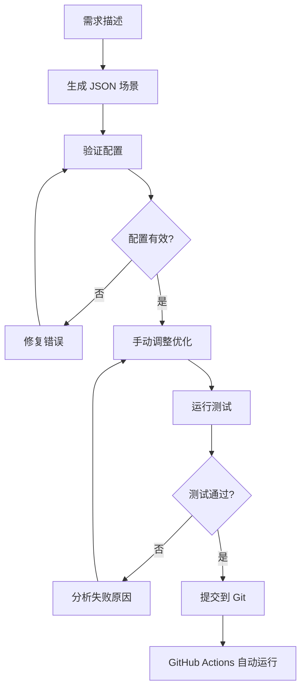

# JSON 场景测试指南

本指南介绍如何使用 JSON 配置文件来定义和运行 AutoDev 的集成测试场景。

## 📋 目录

- [概述](#概述)
- [快速开始](#快速开始)
- [工作流程](#工作流程)
- [命令参考](#命令参考)
- [GitHub Actions 集成](#github-actions-集成)
- [最佳实践](#最佳实践)

## 🎯 概述

JSON 场景测试框架提供了一种声明式的方式来定义复杂的测试场景，特别适合：

- ✅ 多工具调用场景（read-file, write-file, edit-file, shell 等）
- ✅ 复杂的文件变更验证
- ✅ 需要引用外部文档的场景
- ✅ CI/CD 自动化测试
- ✅ 非开发人员也能编写测试用例

### 架构

```
mpp-ui/
├── src/test/
│   ├── framework/
│   │   ├── loaders/
│   │   │   ├── JsonScenarioLoader.ts    # JSON 加载器
│   │   │   └── README.md                # 加载器文档
│   │   └── ...
│   └── integration-v2/
│       ├── scenarios/                    # JSON 场景目录
│       │   ├── spring-ai-deepseek.json
│       │   ├── complex-multi-tool.json
│       │   └── README.md
│       └── json-scenarios.test.ts        # 测试运行器
└── scripts/
    ├── generate-test-scenario.js         # 场景生成器
    └── validate-scenarios.js             # 场景验证器
```

## 🚀 快速开始

### 1. 生成测试场景

```bash
# 方式 1: 命令行快速生成
npm run generate:scenario -- "Add Spring AI with DeepSeek to project"

# 方式 2: 交互式模式（推荐）
npm run generate:scenario:interactive
```

### 2. 验证场景配置

```bash
npm run validate:scenarios
```

### 3. 运行测试

```bash
# 运行所有 JSON 场景测试
npm run test:json-scenarios

# 或使用别名
npm run test:scenarios
```

## 🔄 工作流程

### 完整流程



### 详细步骤

#### 步骤 1: 生成场景

使用交互式模式获得最佳体验：

```bash
npm run generate:scenario:interactive
```

系统会询问：

1. **需求描述**: 例如 "Add Spring AI with DeepSeek to project"
2. **测试类别**: basic-robustness, business-scenario, error-recovery, performance
3. **项目类型**: gradle-spring-boot, maven-spring-boot, npm-node
4. **文档链接**: 相关文档 URL（可选）
5. **超时时间**: 默认 600000ms (10分钟)

生成器会自动推断：

- 需要的工具调用
- 期望的文件变更
- 合理的质量阈值

#### 步骤 2: 验证配置

```bash
npm run validate:scenarios
```

验证器会检查：

- ✅ JSON 格式正确性
- ✅ 必需字段完整性
- ✅ 字段值有效性
- ✅ 正则表达式有效性
- ✅ 数值范围合理性

#### 步骤 3: 手动优化

编辑生成的 JSON 文件，调整：

```json
{
  "expectedTools": [
    {
      "tool": "read-file",
      "required": true,
      "minCalls": 2,        // 调整最小调用次数
      "maxCalls": 10,       // 调整最大调用次数
      "order": 1,           // 指定调用顺序
      "description": "..."  // 添加说明
    }
  ],
  "expectedChanges": [
    {
      "type": "file-modified",
      "path": "build.gradle.kts",
      "content": "spring-ai-deepseek",  // 期望的内容
      "required": true
    }
  ],
  "quality": {
    "minToolAccuracy": 0.75,      // 提高准确度要求
    "maxExecutionTime": 480000,   // 调整超时时间
    "minTaskCompletion": 0.85,    // 提高完成度要求
    "maxCodeIssues": 2            // 降低允许的问题数
  }
}
```

#### 步骤 4: 运行测试

```bash
# 基本运行
npm run test:json-scenarios

# 保留测试项目（用于调试）
KEEP_TEST_PROJECTS=true npm run test:json-scenarios

# 启用详细日志
DEBUG=true npm run test:json-scenarios
```

#### 步骤 5: 分析结果

测试结果会显示：

- ✅ 工具调用分析（准确性、顺序、参数）
- ✅ 文件变更分析（创建、修改、删除）
- ✅ 代码质量分析（问题数量、类型）
- ✅ 任务完成度分析
- ✅ 综合得分

## 📚 命令参考

### 场景生成

```bash
# 快速生成
npm run generate:scenario -- "需求描述"

# 交互式生成
npm run generate:scenario:interactive

# 示例
npm run generate:scenario -- "Add Redis cache to Spring Boot project"
npm run generate:scenario -- "Implement User CRUD with REST API"
npm run generate:scenario -- "Add JWT authentication"
```

### 场景验证

```bash
# 验证所有场景
npm run validate:scenarios
```

### 测试运行

```bash
# 运行所有 JSON 场景
npm run test:json-scenarios
npm run test:scenarios  # 别名

# 运行所有集成测试（包括 JSON 场景）
npm run test:integration-v2

# 环境变量
KEEP_TEST_PROJECTS=true npm run test:scenarios  # 保留测试项目
DEBUG=true npm run test:scenarios               # 详细日志
```

### 构建和测试

```bash
# 完整构建和测试流程
npm run build:kotlin      # 构建 Kotlin 代码
npm run build:ts          # 构建 TypeScript 代码
npm run build             # 完整构建
npm run test:scenarios    # 运行场景测试
```

## 🤖 GitHub Actions 集成

### 自动触发

测试会在以下情况自动运行：

1. **Push 到主分支**
   - 修改了 `mpp-ui/src/test/integration-v2/scenarios/**/*.json`
   - 修改了测试框架代码

2. **Pull Request**
   - 自动验证新的场景配置
   - 运行所有场景测试

3. **手动触发**
   - 在 GitHub Actions 页面手动运行
   - 可选参数：
     - `scenario_filter`: 过滤场景
     - `keep_test_projects`: 保留测试项目

### 工作流程

```yaml
# .github/workflows/json-scenario-tests.yml

jobs:
  validate-scenarios:
    # 验证 JSON 格式和配置
    
  run-json-scenarios:
    # 运行所有场景测试
    
  report-results:
    # 生成测试报告
```

### 查看结果

1. 进入 GitHub Actions 页面
2. 选择 "JSON Scenario Tests" 工作流
3. 查看运行结果和日志
4. 下载测试结果 artifacts

## 💡 最佳实践

### 1. 场景设计

**DO ✅**

- 使用描述性的 ID 和名称
- 提供详细的任务描述和上下文
- 引用相关文档链接
- 设置合理的质量阈值
- 使用正则表达式匹配文件路径

**DON'T ❌**

- 不要设置过于严格的 minCalls/maxCalls
- 不要将所有工具都标记为 required
- 不要使用过短的超时时间
- 不要忽略警告信息

### 2. 工具调用配置

```json
{
  "expectedTools": [
    {
      "tool": "read-file",
      "required": true,        // 关键工具才设为 true
      "minCalls": 1,           // 设置合理的范围
      "maxCalls": 10,          // 不要过于严格
      "order": 1,              // 指定合理的顺序
      "description": "..."     // 添加说明
    }
  ]
}
```

### 3. 文件变更验证

```json
{
  "expectedChanges": [
    {
      "type": "file-created",
      "pattern": ".*Service\\.java",  // 使用正则匹配
      "required": true,
      "description": "Service class should be created"
    },
    {
      "type": "file-modified",
      "path": "build.gradle.kts",     // 或使用精确路径
      "content": "spring-ai",         // 验证内容
      "required": true
    }
  ]
}
```

### 4. 质量阈值

根据场景复杂度调整：

| 场景类型 | minToolAccuracy | minTaskCompletion | maxCodeIssues |
|---------|-----------------|-------------------|---------------|
| 简单    | 0.8 - 0.9       | 0.9 - 1.0         | 0 - 1         |
| 中等    | 0.7 - 0.8       | 0.8 - 0.9         | 1 - 3         |
| 复杂    | 0.6 - 0.7       | 0.7 - 0.8         | 2 - 5         |

### 5. 调试技巧

```bash
# 1. 保留测试项目
KEEP_TEST_PROJECTS=true npm run test:scenarios

# 2. 查看生成的代码
ls -la /tmp/autodev-test-*

# 3. 启用详细日志
DEBUG=true npm run test:scenarios

# 4. 单独运行某个场景
# 编辑 json-scenarios.test.ts，使用 .only
it.only('应该成功加载并运行 Spring AI DeepSeek 场景', ...)
```

## 📖 示例场景

### Spring AI DeepSeek 集成

```json
{
  "id": "spring-ai-deepseek-001",
  "name": "Add Spring AI with DeepSeek to Project",
  "task": {
    "description": "Add Spring AI to the project with DeepSeek provider...",
    "documentation": [
      "https://docs.spring.io/spring-ai/reference/api/chat/deepseek-chat.html"
    ]
  },
  "expectedTools": [
    { "tool": "read-file", "required": true, "order": 1 },
    { "tool": "web-fetch", "required": false, "order": 2 },
    { "tool": "edit-file", "required": true, "order": 3 },
    { "tool": "write-file", "required": true, "order": 4 },
    { "tool": "shell", "required": false, "order": 5 }
  ],
  "expectedChanges": [
    {
      "type": "file-modified",
      "path": "build.gradle.kts",
      "content": "spring-ai-deepseek",
      "required": true
    },
    {
      "type": "file-created",
      "pattern": ".*DeepSeek.*Service\\.java",
      "required": true
    }
  ]
}
```

## 🔗 相关文档

- [JSON 场景加载器文档](../mpp-ui/src/test/framework/loaders/README.md)
- [场景目录 README](../mpp-ui/src/test/integration-v2/scenarios/README.md)
- [测试框架概述](../mpp-ui/src/test/framework/README.md)

## 🤝 贡献

欢迎贡献新的测试场景！

1. 使用生成器创建基础配置
2. 手动调整和优化
3. 运行验证和测试
4. 提交 PR

## 📞 支持

遇到问题？

1. 检查 JSON 格式和配置
2. 运行验证器查看错误
3. 查看测试日志
4. 参考现有场景示例

