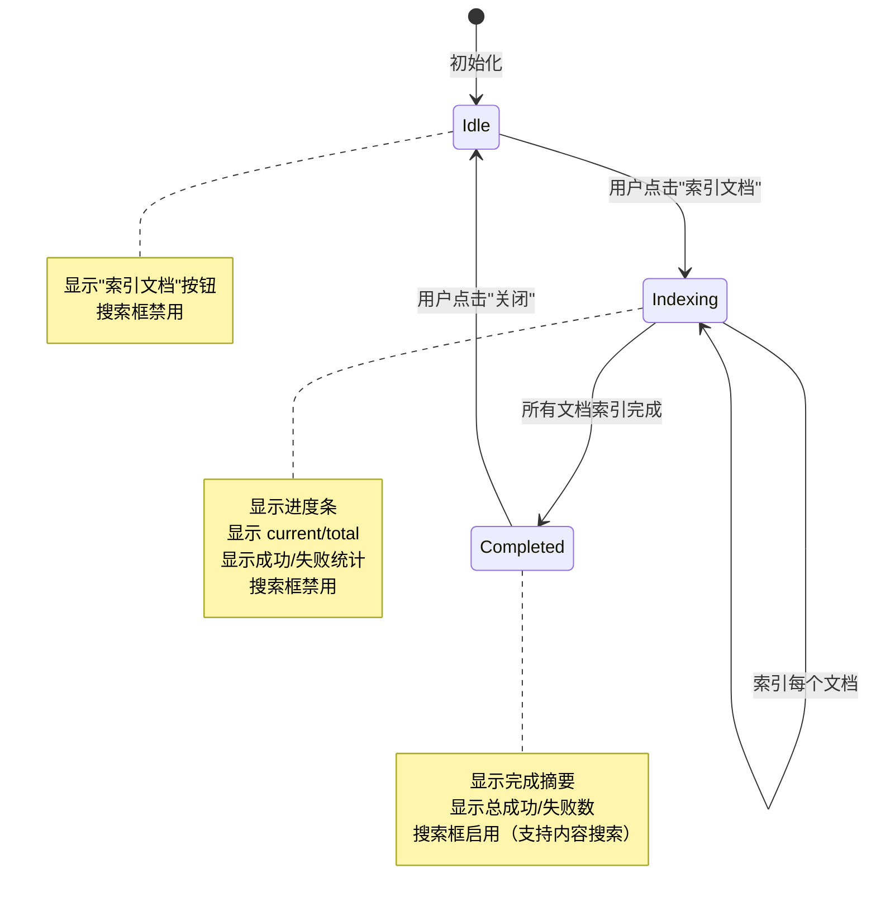
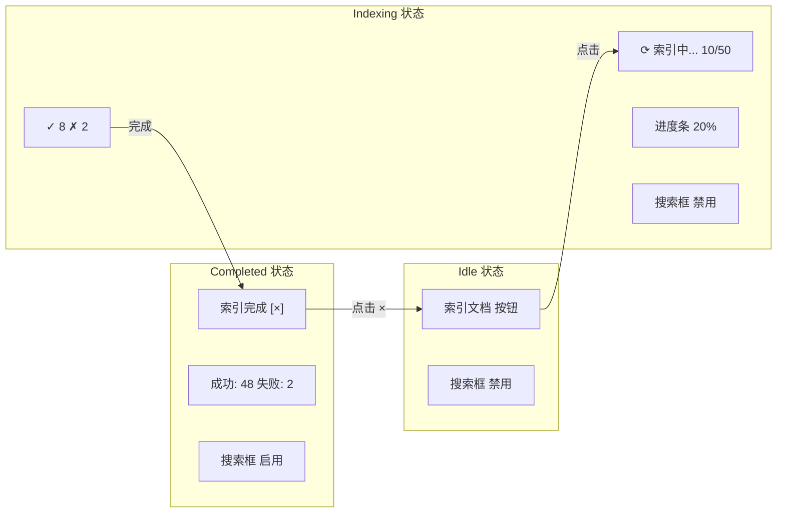
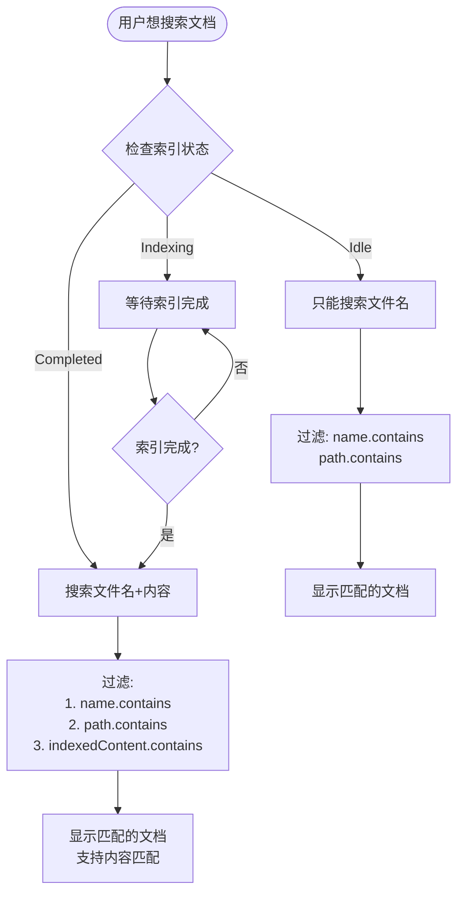
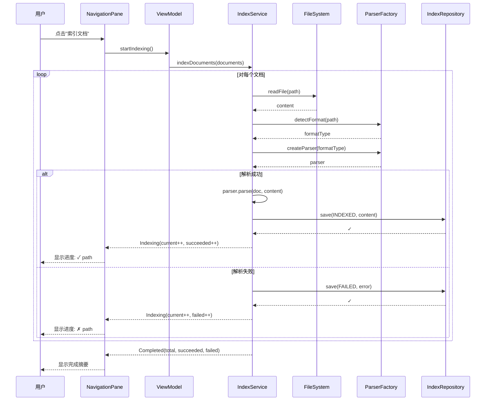
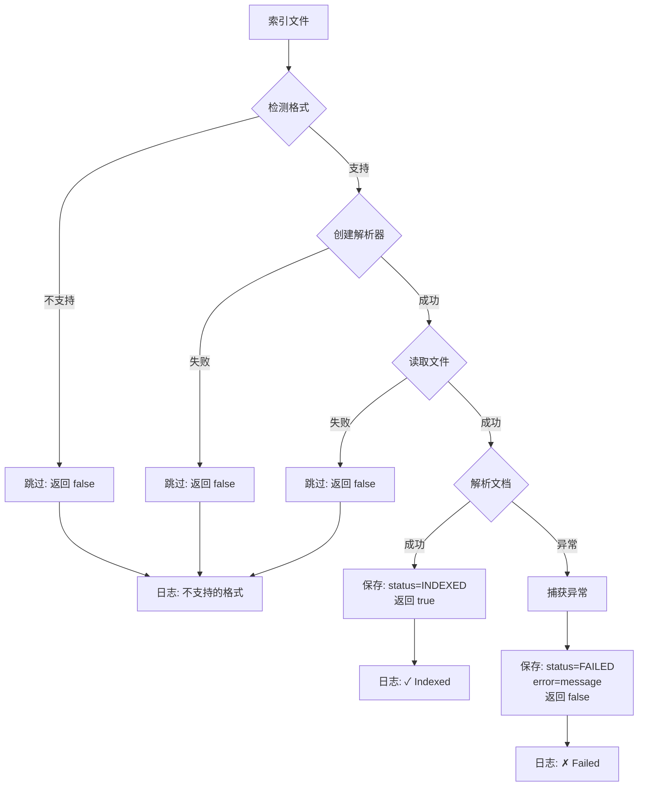
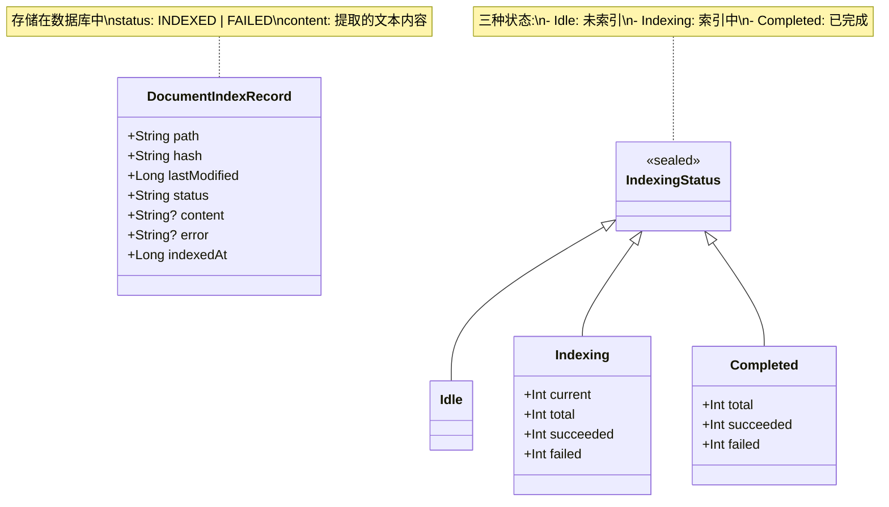
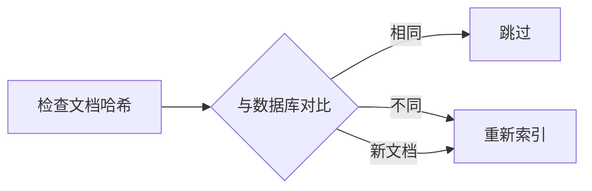
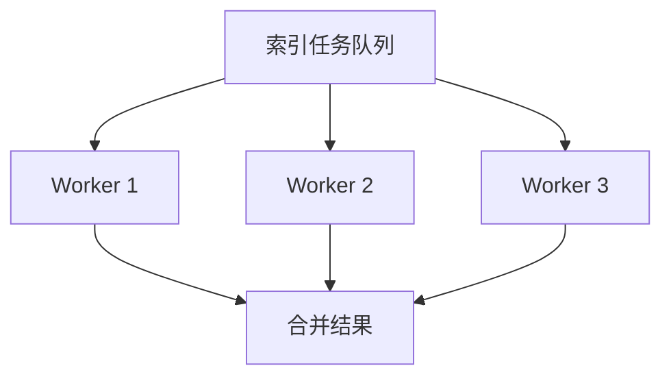
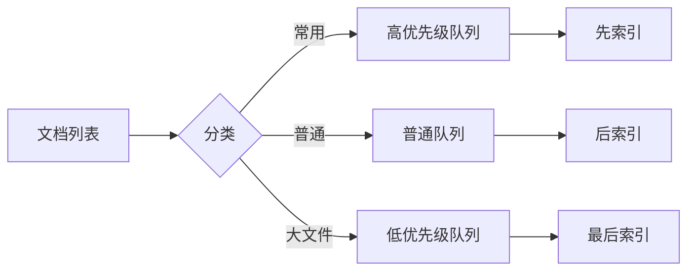

# 文档索引流程图

## 索引状态转换图



## 文档索引详细流程

```mermaid
flowchart TD
    Start([用户进入页面]) --> LoadDocs[加载文档列表]
    LoadDocs --> ShowDocs[显示文档树]
    ShowDocs --> ShowBtn[显示"索引文档"按钮]
    
    ShowBtn --> WaitUser{用户操作}
    WaitUser -->|点击索引按钮| StartIndex[开始索引]
    WaitUser -->|其他操作| ShowBtn
    
    StartIndex --> InitStatus[设置状态: Indexing<br/>current=0, total=N]
    InitStatus --> LoopStart{还有文档?}
    
    LoopStart -->|是| IndexOne[索引一个文档]
    IndexOne --> UseParser[使用 DocumentParserFactory<br/>创建解析器]
    UseParser --> Parse{解析成功?}
    
    Parse -->|成功| SaveIndex[保存到索引数据库<br/>status=INDEXED]
    Parse -->|失败| SaveError[保存错误信息<br/>status=FAILED]
    
    SaveIndex --> IncSuccess[succeeded++]
    SaveError --> IncFailed[failed++]
    
    IncSuccess --> UpdateProgress[更新进度<br/>current++]
    IncFailed --> UpdateProgress
    
    UpdateProgress --> LogResult[输出日志<br/>✓ 或 ✗]
    LogResult --> LoopStart
    
    LoopStart -->|否| SetCompleted[设置状态: Completed<br/>total, succeeded, failed]
    SetCompleted --> EnableSearch[启用搜索框]
    EnableSearch --> ShowSummary[显示完成摘要]
    
    ShowSummary --> WaitClose{用户操作}
    WaitClose -->|点击关闭| ResetStatus[重置状态: Idle]
    WaitClose -->|使用搜索| EnableSearch
    
    ResetStatus --> ShowBtn
```

## UI 状态展示



## 索引与搜索的关系



## 索引过程中的数据流



## 错误处理流程



## 索引数据结构



## 性能考虑

### 1. 索引时机
```
┌─────────────────────────────────────┐
│ 页面加载                             │
│  ↓                                  │
│ 加载文档列表 (searchFiles)          │  <- 快速
│  ↓                                  │
│ 显示文档树                           │
│  ↓                                  │
│ [用户决定何时索引] ← 用户控制        │
│  ↓                                  │
│ 索引文档 (parse + save)              │  <- 耗时
└─────────────────────────────────────┘
```

### 2. 索引优化策略

| 策略 | 说明 | 优势 |
|------|------|------|
| 延迟索引 | 不在加载时自动索引 | 减少初始加载时间 |
| 哈希检测 | 通过哈希判断文档是否变化 | 避免重复索引 |
| 批量处理 | 一次处理多个文档 | 提高吞吐量 |
| 进度反馈 | 实时显示进度 | 改善用户体验 |
| 错误继续 | 单个失败不中断整体 | 提高健壮性 |

### 3. 内存使用

```
每个文档索引时:
1. 读取文件内容 (String)       <- 内存占用
2. 解析文档                    <- 临时对象
3. 提取文本内容                <- 保存到数据库
4. 释放内存                    <- GC
```

## 未来增强功能

### 1. 增量索引


### 2. 并行索引


### 3. 优先级索引


