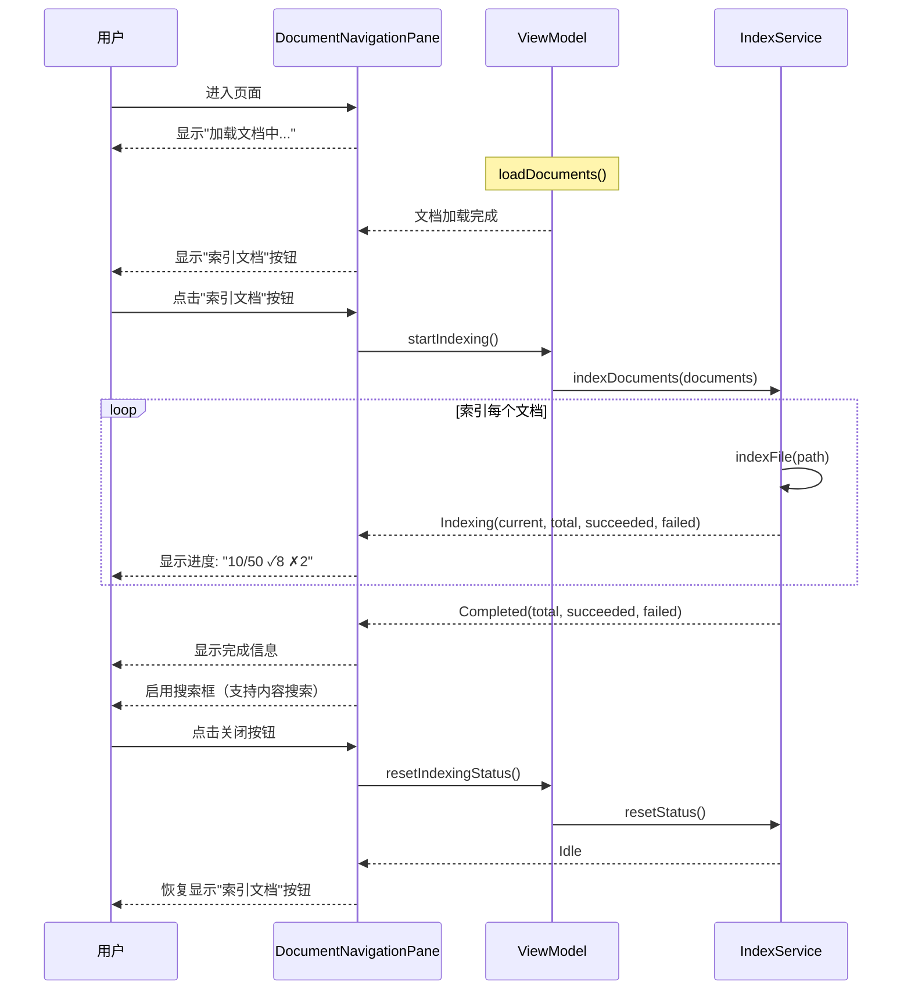

# 文档索引功能优化

## 概述

将文档索引功能从自动触发改为手动触发，优化了索引流程和用户体验。

## 主要改动

### 1. 索引触发方式改变

**改动前：**
- 页面加载时自动触发索引
- 用户无法控制索引时机
- IndexService 自己搜索文件

**改动后：**
- 等待文档加载完成后，用户手动点击"索引文档"按钮触发
- 由 ViewModel 传入已加载的文档列表
- 索引完成后可以重置状态

### 2. DocumentIndexService 优化

#### 新增 `indexDocuments(documents: List<DocumentFile>)` 方法

```kotlin
fun indexDocuments(documents: List<DocumentFile>) {
    scope.launch {
        try {
            val totalFiles = documents.size
            var indexedCount = 0
            var succeededCount = 0
            var failedCount = 0
            
            _indexingStatus.value = IndexingStatus.Indexing(0, totalFiles, 0, 0)
            
            documents.forEach { doc ->
                val success = indexFile(doc.path)
                indexedCount++
                if (success) {
                    succeededCount++
                } else {
                    failedCount++
                }
                _indexingStatus.value = IndexingStatus.Indexing(
                    indexedCount, 
                    totalFiles, 
                    succeededCount, 
                    failedCount
                )
            }
            
            _indexingStatus.value = IndexingStatus.Completed(
                totalFiles,
                succeededCount,
                failedCount
            )
        } catch (e: Exception) {
            println("Error during indexing: ${e.message}")
            _indexingStatus.value = IndexingStatus.Idle
        }
    }
}
```

#### IndexingStatus 增强

```kotlin
sealed class IndexingStatus {
    object Idle : IndexingStatus()
    
    data class Indexing(
        val current: Int,
        val total: Int,
        val succeeded: Int = 0,
        val failed: Int = 0
    ) : IndexingStatus()
    
    data class Completed(
        val total: Int,
        val succeeded: Int,
        val failed: Int
    ) : IndexingStatus()
}
```

新增统计信息：
- `succeeded`: 成功索引的文档数
- `failed`: 失败的文档数
- `Completed` 状态：索引完成后显示总结

#### indexFile 方法优化

- 返回布尔值表示成功/失败
- 添加日志输出（✓ 成功，✗ 失败）
- 更好的错误处理

### 3. DocumentNavigationPane UI 优化

#### 三种索引状态的 UI

**1. Idle 状态**
```
┌─────────────────────────────┐
│  [图标] 索引文档              │  <- 按钮
└─────────────────────────────┘
```

**2. Indexing 状态**
```
┌─────────────────────────────┐
│ ⟳ 索引中...        10/50     │
│ ▓▓▓▓▓░░░░░░░░░░░░  (20%)     │  <- 进度条
│ ✓ 8    ✗ 2                   │  <- 成功/失败统计
└─────────────────────────────┘
```

**3. Completed 状态**
```
┌─────────────────────────────┐
│ 索引完成                  [×] │  <- 可关闭
│ 成功: 48  失败: 2             │
└─────────────────────────────┘
```

#### 搜索框状态

- **文档未加载**: "加载文档后可搜索..."（禁用）
- **索引未完成**: "索引完成后可搜索内容..."（禁用）
- **索引完成**: "搜索文档（文件名和内容）..."（启用）

### 4. DocumentReaderViewModel 改动

#### 移除自动索引

```kotlin
init {
    loadDocuments()
    initializeLLMService()
    // 不自动索引，等待用户手动触发
}
```

#### 新增方法

```kotlin
/**
 * Manually trigger indexing for all loaded documents
 */
fun startIndexing() {
    if (documents.isEmpty()) {
        println("No documents to index")
        return
    }
    indexService.indexDocuments(documents)
}

/**
 * Reset indexing status to Idle
 */
fun resetIndexingStatus() {
    indexService.resetStatus()
}
```

## 用户交互流程



## 优势

### 1. 用户可控
- 用户决定何时索引
- 可以看到索引进度和结果
- 索引失败可以重试

### 2. 性能优化
- 不会在页面加载时自动索引（减少初始负载）
- 只索引已加载的文档（避免重复搜索）
- 用户可以选择在空闲时索引

### 3. 更好的反馈
- 实时显示索引进度
- 显示成功/失败统计
- 清晰的状态转换

### 4. 灵活扩展
- 未来可以添加选择性索引（只索引某些文档）
- 可以添加增量索引（只索引新文档或修改的文档）
- 可以添加索引优先级

## 索引日志示例

```
✓ Indexed: docs/README.md
✓ Indexed: docs/guide.md
✗ Failed to index: docs/corrupted.pdf - File format not supported
✓ Indexed: src/main.kt
✓ Indexed: src/utils.kt
...
```

每个文档索引时会输出：
- ✓ 成功索引
- ✗ 索引失败及原因

## 未来改进方向

### 1. 增量索引
- 检测文档变化（通过文件哈希）
- 只重新索引修改的文档
- 减少不必要的重复索引

### 2. 选择性索引
- 允许用户选择要索引的文档
- 按文件类型过滤
- 按路径过滤

### 3. 后台索引
- 使用 Web Worker（JS）或后台线程（JVM）
- 不阻塞 UI
- 支持取消操作

### 4. 索引缓存持久化
- 将索引结果保存到本地数据库
- 下次打开时直接加载缓存
- 减少重复索引时间

### 5. 智能索引
- 优先索引常用文档
- 根据文件大小调整索引策略
- 跳过二进制或超大文件

## API 变更总结

### DocumentIndexService

| 方法 | 状态 | 说明 |
|------|------|------|
| `indexDocuments(List<DocumentFile>)` | ✨ 新增 | 索引指定的文档列表 |
| `resetStatus()` | ✨ 新增 | 重置索引状态为 Idle |
| `indexFile(String): Boolean` | 🔄 修改 | 返回布尔值表示成功/失败 |
| `indexWorkspace()` | ⚠️ 废弃 | 推荐使用 indexDocuments |

### IndexingStatus

| 状态 | 字段 | 说明 |
|------|------|------|
| `Idle` | - | 空闲状态 |
| `Indexing` | current, total, succeeded, failed | 索引中（新增统计字段） |
| `Completed` | total, succeeded, failed | ✨ 新增：索引完成 |

### DocumentReaderViewModel

| 方法 | 状态 | 说明 |
|------|------|------|
| `startIndexing()` | ✨ 新增 | 手动触发索引 |
| `resetIndexingStatus()` | ✨ 新增 | 重置索引状态 |
| `refreshDocuments()` | 🔄 修改 | 不再自动触发索引 |

