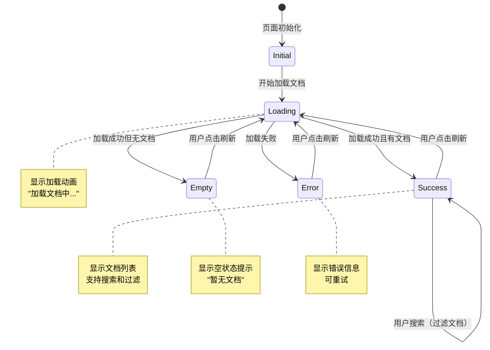
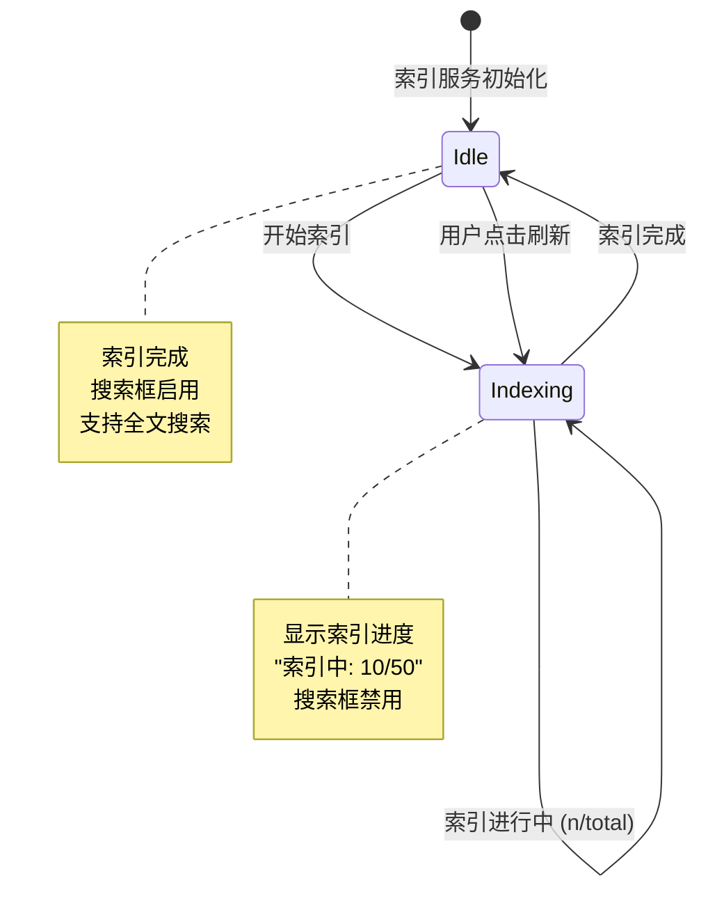
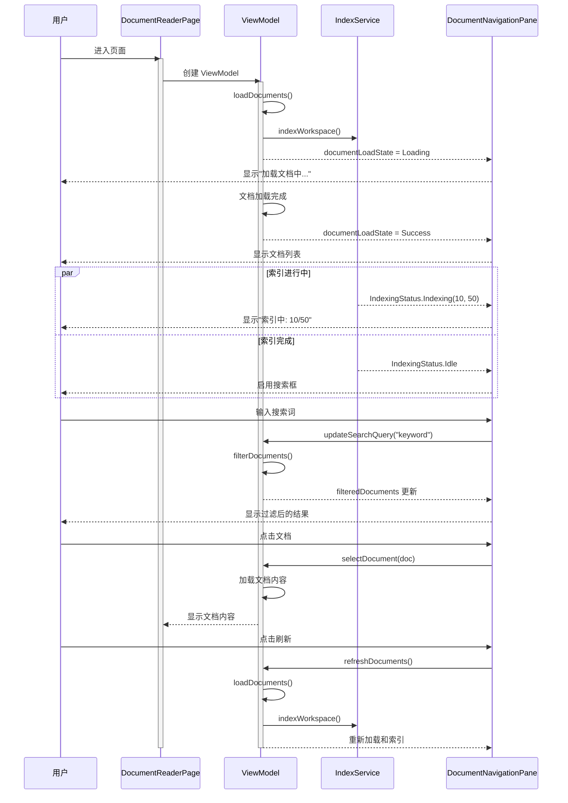

# 文档阅读器状态流程图

## 状态转换流程



## 索引状态流程



## 搜索功能流程

```mermaid
flowchart TD
    A[用户输入搜索词] --> B{索引是否完成?}
    B -->|是| C[搜索文件名 + 内容]
    B -->|否| D[仅搜索文件名]
    
    C --> E{有匹配结果?}
    D --> E
    
    E -->|是| F[显示过滤后的文档列表]
    E -->|否| G[显示"未找到匹配的文档"]
    
    F --> H[用户可以选择文档]
    G --> I[用户可以清空搜索]
    
    I --> J[显示全部文档]
```

## 用户交互流程



## 状态对应的 UI 显示

| 状态 | UI 显示 | 用户可操作 |
|------|---------|-----------|
| Initial | 无显示 | - |
| Loading | 加载动画 + "加载文档中..." | - |
| Success (有结果) | 文档树列表 | 搜索、选择、刷新 |
| Success (搜索无结果) | "未找到匹配的文档" | 清空搜索、刷新 |
| Empty | "暂无文档" + 提示信息 | 刷新 |
| Error | 错误图标 + 错误信息 | 刷新 |

## 搜索功能特性

### 搜索范围

1. **文件名搜索**（始终可用）
   - 匹配文件名
   - 匹配文件路径

2. **内容搜索**（索引完成后可用）
   - 搜索已索引的文档内容
   - 仅搜索状态为 "INDEXED" 的文档

### 搜索行为

- **实时搜索**：输入即搜索，无需按回车
- **大小写不敏感**：自动转换为小写匹配
- **OR 逻辑**：文件名或内容匹配即显示
- **空查询**：显示所有文档

### 搜索 UI

- **搜索框状态**
  - 索引中：禁用，显示"索引完成后可搜索..."
  - 索引完成：启用，显示"搜索文档..."
  
- **清空按钮**
  - 有搜索词时显示
  - 点击清空搜索，恢复显示所有文档
  
- **刷新按钮**
  - 始终显示
  - 重新加载文档列表和重建索引

