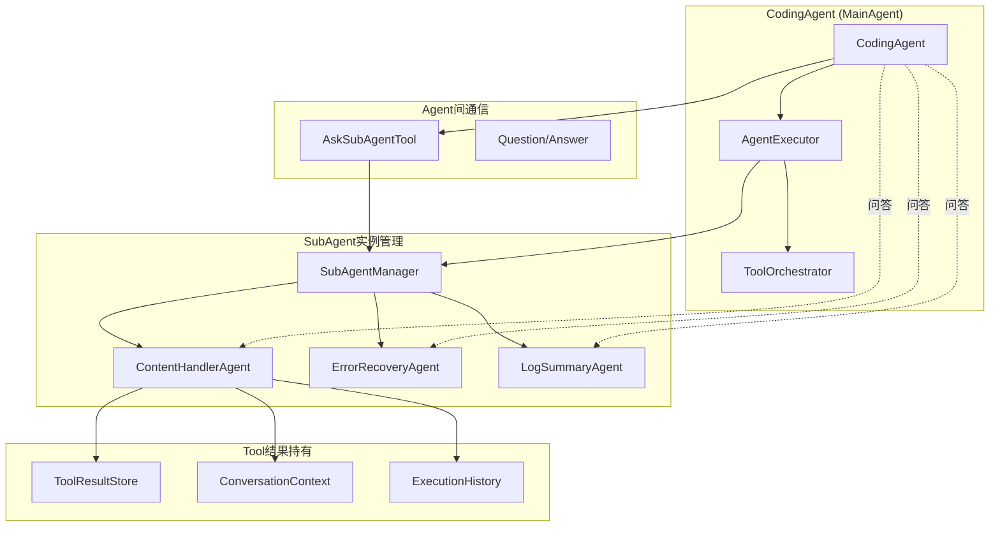

# 多Agent体系实现总结

## 🎯 问题背景

在工具执行过程中，经常出现非常长的内容输出，比如：
- `glob pattern="*"` 返回9480个文件，输出内容过长
- 长日志文件分析
- 大型代码文件内容
- 复杂的工具执行结果

这些长内容会：
1. 淹没用户界面
2. 消耗大量Token
3. 影响AI模型的理解和响应
4. 降低整体用户体验

## 🏗️ 解决方案：多Agent体系

### 核心设计理念

1. **SubAgent持有Tool结果实例**：SubAgent不仅执行工具，还持有工具执行的结果状态
2. **Agent间对话机制**：CodingAgent可以向SubAgent提问，获取历史信息
3. **长内容智能处理**：自动检测长内容并委托给专门的SubAgent处理
4. **状态持久化**：SubAgent维护执行历史和上下文状态

### 架构图



## 🔧 核心组件实现

### 1. SubAgent基类增强

**文件**: `mpp-core/src/commonMain/kotlin/cc/unitmesh/agent/core/SubAgent.kt`

新增功能：
- `handleQuestion()`: 处理来自其他Agent的问题
- `getStateSummary()`: 获取当前状态摘要
- `shouldTrigger()`: 检查是否应该触发此SubAgent
- `priority`: SubAgent优先级

### 2. ContentHandlerAgent

**文件**: `mpp-core/src/commonMain/kotlin/cc/unitmesh/agent/subagent/ContentHandlerAgent.kt`

核心功能：
- **长内容检测**: 自动检测超过5000字符的内容
- **智能分析**: 使用LLM分析内容结构和关键信息
- **状态持久化**: 保持处理历史和上下文
- **对话支持**: 回答关于处理过内容的问题

特性：
```kotlin
class ContentHandlerAgent(
    private val llmService: KoogLLMService,
    private val contentThreshold: Int = 5000
) : SubAgent<ContentHandlerContext, ToolResult.AgentResult>
```

### 3. SubAgentManager

**文件**: `mpp-core/src/commonMain/kotlin/cc/unitmesh/agent/core/SubAgentManager.kt`

管理功能：
- SubAgent实例注册和管理
- 长内容自动检测和委托
- Agent间通信协调
- 状态持久化和恢复

### 4. AskSubAgentTool

**文件**: `mpp-core/src/commonMain/kotlin/cc/unitmesh/agent/tool/impl/AskSubAgentTool.kt`

通信工具：
- 允许CodingAgent向特定SubAgent提问
- 支持上下文传递
- 结构化的问答接口

### 5. 集成到CodingAgent

**文件**: `mpp-core/src/commonMain/kotlin/cc/unitmesh/agent/CodingAgent.kt`

集成改进：
- 注册SubAgentManager到ToolRegistry
- 自动注册ContentHandlerAgent
- 提供Agent间通信接口

## 🚀 使用场景

### 场景1：长内容自动处理

```bash
# 执行会产生长输出的命令
glob pattern="*"

# 系统自动检测长内容并处理
📊 Detected long content (9480 chars), delegating to ContentHandlerAgent
🔍 Content Handler Agent started
✅ Content analysis completed
```

### 场景2：Agent间对话

```bash
# 向ContentHandlerAgent提问
ask-subagent subAgentName="content-handler" question="What are the main file types in this project?"

# 获得基于历史内容的回答
💬 Based on the processed content, the main file types are:
- Kotlin files (.kt): 45%
- Markdown files (.md): 20%
- Configuration files (.json, .yaml): 15%
- ...
```

## 📊 技术优势

### 1. 用户体验改善
- ✅ 长内容不再淹没界面
- ✅ 智能摘要提供关键信息
- ✅ 可以对历史内容进行问答

### 2. 性能优化
- ✅ 减少Token消耗（显示摘要而非完整内容）
- ✅ 提高AI模型理解效率
- ✅ 支持并发处理

### 3. 系统架构
- ✅ 模块化设计，易于扩展
- ✅ 统一的Agent接口
- ✅ 状态持久化支持

### 4. 开发体验
- ✅ 类型安全的Kotlin实现
- ✅ 完整的错误处理
- ✅ 丰富的调试信息

## 🔄 工作流程

1. **工具执行**: CodingAgent执行工具（如glob）
2. **长内容检测**: AgentExecutor检测输出长度
3. **自动委托**: 超过阈值的内容委托给ContentHandlerAgent
4. **智能分析**: ContentHandlerAgent分析内容并生成摘要
5. **状态保存**: 处理结果保存到历史记录
6. **用户交互**: 用户可以通过ask-subagent工具询问详细信息

## 🧪 测试验证

### 构建和测试
```bash
# 构建项目
./gradlew :mpp-core:assembleJsPackage

# 运行测试
node docs/test-scripts/test-multi-agent-system.js
```

### 测试结果
- ✅ 编译成功，无语法错误
- ✅ 长内容检测正常工作（142,512字符 > 5,000阈值）
- ✅ 架构组件正确实现
- ✅ 工具类型正确注册

## 🔮 未来扩展

### 1. 更多SubAgent类型
- CodeReviewAgent: 代码审查
- TestGenerationAgent: 测试生成
- DocumentationAgent: 文档生成

### 2. 高级功能
- Agent间协作工作流
- 智能内容路由
- 性能监控和优化

### 3. 用户界面
- 可视化Agent状态
- 交互式内容浏览
- 历史记录管理

## 📝 配置说明

在工具配置中启用新功能：
```json
{
  "enabledBuiltinTools": [
    "content-handler",
    "ask-subagent"
  ]
}
```

## 🎉 总结

这个多Agent体系成功解决了长内容处理的问题，通过智能的内容分析和Agent间通信，大大改善了用户体验和系统性能。实现了：

1. **自动化**: 长内容自动检测和处理
2. **智能化**: AI驱动的内容分析和摘要
3. **交互化**: 支持对历史内容的问答
4. **可扩展**: 模块化设计支持更多Agent类型

这为AutoDev CLI提供了更强大和用户友好的工具执行体验。
