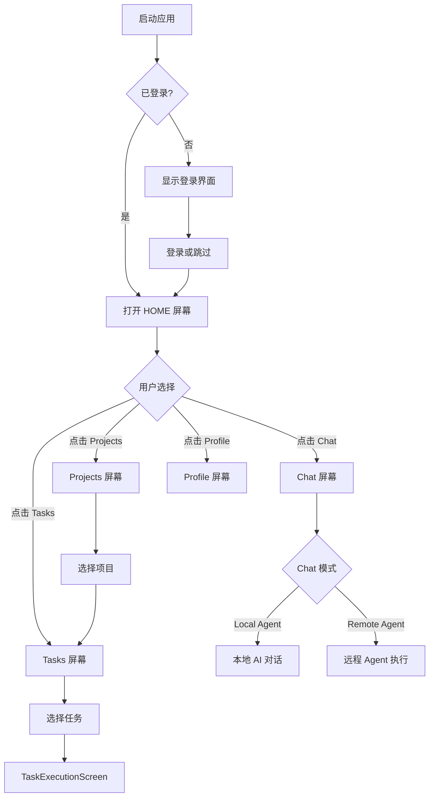
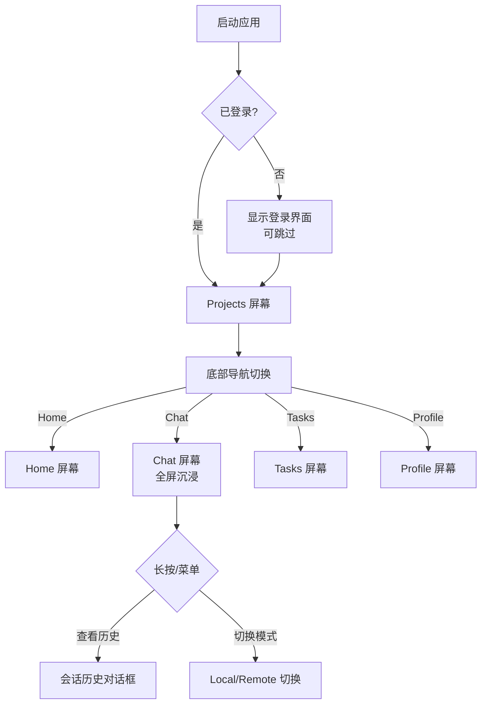

# AutoDevApp 重构设计方案

## 📋 现状分析

### AutoDevApp.kt - AI 对话应用
**核心功能**:
- ✅ 本地 AI Chat（ChatHistoryManager + LLM）
- ✅ Agent 模式（Local/Remote 可切换）
- ✅ SessionSidebar（本地+远程会话历史）
- ✅ 工作空间管理（WorkspaceManager）
- ✅ 配置管理（Model、Tool、Remote Server）
- ✅ TreeView（Agent 模式文件浏览）

**UI 架构**:
```
Desktop:  [SessionSidebar] + [TopBar + Chat/Agent Content]
WASM:     [TopBarMenu侧边栏] + [Chat/Agent Content]
Android:  跳转到 UnifiedAppContent
```

**特点**:
- 单页应用，专注于 AI 对话
- 支持 Chat 和 Agent 两种模式
- SessionSidebar 独立管理会话历史

### SessionApp.kt - 项目任务管理应用
**核心功能**:
- ✅ 用户登录/注册
- ✅ 项目管理（CRUD + Git）
- ✅ 任务管理（基于项目）
- ✅ Remote Agent 执行（TaskExecutionScreen）
- ✅ 多屏幕导航

**UI 架构**:
```
Desktop:  [Sidebar(Sessions/Projects列表)] + [Content]
Android:  [Drawer + BottomNavigation] + [Content]
```

**特点**:
- 多屏幕应用（Projects/Tasks/Sessions/Profile）
- 完整的业务流程：Login → Projects → Tasks → Execution
- ViewModel 架构清晰

---

## 🎯 融合策略

### 1. 统一的屏幕架构

```
┌─────────────────────────────────────────────────────────────┐
│                        Unified App                           │
├─────────────────────────────────────────────────────────────┤
│  Screen 1: HOME        - 欢迎页/仪表盘（可选）               │
│  Screen 2: CHAT        - AI 对话（原 AutoDevApp 核心）      │
│  Screen 3: PROJECTS    - 项目管理                            │
│  Screen 4: TASKS       - 任务管理                            │
│  Screen 5: PROFILE     - 配置/设置                           │
└─────────────────────────────────────────────────────────────┘
```

**屏幕定义**:
```kotlin
enum class AppScreen {
    HOME,       // 仪表盘（可选，显示最近使用的项目/会话）
    CHAT,       // AI 对话（Local/Remote Agent）
    PROJECTS,   // 项目列表
    TASKS,      // 任务列表（基于选中的项目）
    PROFILE     // 用户资料 + 配置（Model/Tool/Remote Server）
}
```

### 2. Desktop UI 设计

```
┌──────────────────────────────────────────────────────────────────┐
│  [SessionSidebar]  │  [TopBar/Nav]  │  [Main Content]           │
│  - 固定左侧        │                │                            │
│  - 240px 宽        │                │                            │
│  - 可折叠          │                │                            │
│  ─────────────────────────────────────────────────────────────── │
│  Local Sessions    │  [Settings ⚙]  │  ┌─────────────────────┐  │
│  - Chat 1          │  [Tools 🔧]    │  │                     │  │
│  - Chat 2          │  [Debug 🐛]    │  │                     │  │
│                    │                │  │   Content Area      │  │
│  Remote Sessions   │  [Nav Tabs]    │  │                     │  │
│  - R Session 1     │  • Home        │  │   (Chat/Projects/   │  │
│                    │  • Chat ✓      │  │    Tasks/Profile)   │  │
│  ─────────────────  │  • Projects    │  │                     │  │
│  [+ New Chat]      │  • Tasks       │  │                     │  │
│  [Settings]        │  • Profile     │  └─────────────────────┘  │
│  [Tools]           │                │                            │
│  [Debug]           │                │                            │
└──────────────────────────────────────────────────────────────────┘
```

**设计要点**:
- **SessionSidebar**: 
  - 始终显示在最左侧（240px）
  - 支持折叠（显示/隐藏按钮）
  - 显示本地会话 + 远程会话
  - 底部放置全局设置按钮（Model/Tool/Debug）
  
- **TopBar/Navigation**:
  - 横向标签页切换（Home/Chat/Projects/Tasks/Profile）
  - 当前屏幕高亮
  - 可选：面包屑导航（当前项目/任务）
  
- **Main Content**:
  - 根据当前屏幕显示不同内容
  - Chat 屏幕支持 TreeView（SplitPane）
  - Projects/Tasks 使用列表 + 详情布局

### 3. Android UI 设计

```
┌───────────────────────────────────┐
│  [TopBar with Menu & Actions]    │
├───────────────────────────────────┤
│                                   │
│                                   │
│        Main Content               │
│        (Full Screen)              │
│                                   │
│                                   │
│                                   │
├───────────────────────────────────┤
│  [Bottom Navigation]              │
│   🏠 Home  💬 Chat  📋 Tasks  👤  │
└───────────────────────────────────┘

[Drawer Menu (Swipe from left)]
┌───────────────────────┐
│  👤 User Profile      │
│  ────────────────────  │
│  🏠 Home              │
│  💬 Chat              │
│  📁 Projects          │
│  📋 Tasks             │
│  ────────────────────  │
│  ⚙️ Settings          │
│  🔧 Tools             │
│  🐛 Debug (if active) │
│  ────────────────────  │
│  🚪 Logout            │
└───────────────────────┘
```

**设计要点**:
- **Bottom Navigation**:
  - 4 个主要入口：Home/Chat/Projects/Profile
  - 图标 + 文字标签
  - 当前屏幕高亮
  
- **Drawer**:
  - 完整的导航菜单
  - 用户信息展示
  - 设置和配置入口
  - 支持跳过登录（无需认证也能使用本地功能）
  
- **TopBar**:
  - 显示当前屏幕标题
  - 汉堡菜单按钮（打开 Drawer）
  - 操作按钮（新建、搜索等）

### 4. WASM UI 设计

```
┌──────────────────────────────────────────────────────────────┐
│  [Vertical Menu Bar]  │  [Main Content (Full Width)]         │
│  - 左侧固定           │                                       │
│  - 图标按钮           │                                       │
│  ─────────────────────────────────────────────────────────────│
│  🏠                   │  ┌──────────────────────────────────┐ │
│  💬 ✓                 │  │                                  │ │
│  📁                   │  │                                  │ │
│  📋                   │  │      Content Area                │ │
│  ────                 │  │                                  │ │
│  ⚙️                   │  │                                  │ │
│  🔧                   │  │                                  │ │
│  🐛                   │  └──────────────────────────────────┘ │
└──────────────────────────────────────────────────────────────┘
```

**设计要点**:
- **Vertical Menu**: 
  - 极简设计，仅图标（48px 宽）
  - 当前屏幕高亮
  - 悬停显示 Tooltip
  
- **No SessionSidebar**:
  - WASM 不显示 SessionSidebar（节省空间）
  - 会话历史通过弹窗或下拉菜单访问
  
- **Content Area**:
  - 占据剩余全部宽度
  - Chat 模式支持紧凑布局

---

## 🏗️ 技术架构

### 1. 统一的 ViewModel 层

```kotlin
// 统一的应用上下文
data class UnifiedAppContext(
    // Session 相关
    val sessionViewModel: SessionViewModel,
    val projectViewModel: ProjectViewModel,
    val taskViewModel: TaskViewModel,
    
    // Chat 相关
    val chatHistoryManager: ChatHistoryManager,
    val workspaceManager: WorkspaceManager,
    val llmService: KoogLLMService?,
    
    // 配置相关
    val currentModelConfig: ModelConfig?,
    val selectedAgentType: String,  // "Local" or "Remote"
    
    // 状态
    val currentScreen: AppScreen,
    val isAuthenticated: Boolean,
    val currentProject: Project?,
    val currentTask: Task?
)
```

### 2. 屏幕路由设计

```kotlin
@Composable
fun UnifiedApp(
    serverUrl: String = "http://localhost:8080",
    initialScreen: AppScreen = AppScreen.HOME
) {
    val context = rememberUnifiedAppContext(serverUrl)
    var currentScreen by remember { mutableStateOf(initialScreen) }
    
    when {
        Platform.isAndroid -> {
            AndroidLayout(context, currentScreen) { currentScreen = it }
        }
        Platform.isWasm -> {
            WasmLayout(context, currentScreen) { currentScreen = it }
        }
        else -> {
            DesktopLayout(context, currentScreen) { currentScreen = it }
        }
    }
}
```

### 3. 屏幕内容组件

```kotlin
@Composable
fun ScreenContent(
    screen: AppScreen,
    context: UnifiedAppContext
) {
    when (screen) {
        AppScreen.HOME -> HomeScreen(context)
        AppScreen.CHAT -> ChatScreen(context) // 原 AutoDevApp 核心
        AppScreen.PROJECTS -> ProjectListScreen(context.projectViewModel)
        AppScreen.TASKS -> TaskListScreen(context.taskViewModel)
        AppScreen.PROFILE -> ProfileScreen(context)
    }
}

@Composable
fun ChatScreen(context: UnifiedAppContext) {
    // 集成原 AutoDevApp 的 Chat/Agent 功能
    // 支持 Local/Remote 切换
    // 支持 Chat/Agent 模式切换
    // 支持 TreeView
}
```

---

## 📱 交互流程设计

### Desktop 用户流程



### Android 用户流程



---

## 🔄 数据流设计

### Session 管理

```
Local Sessions (ChatHistoryManager)
  ↓
  ├─ 本地磁盘持久化
  └─ 内存缓存

Remote Sessions (SessionClient)
  ↓
  ├─ HTTP API
  └─ 认证 Token

Unified SessionSidebar
  ↓
  ├─ 显示本地会话（Local 标签）
  └─ 显示远程会话（Remote 标签）
```

### Project 管理

```
Local Workspace (WorkspaceManager)
  ↓
  ├─ 本地文件系统
  └─ CompletionManager

Remote Projects (ProjectClient)
  ↓
  ├─ Git 仓库
  └─ 项目元数据

Unified Projects Screen
  ↓
  ├─ 显示本地工作空间（Local 标签）
  └─ 显示远程项目（Remote 标签）
```

### 配置管理

```
ConfigManager
  ↓
  ├─ ModelConfig (API Key, Provider, Model)
  ├─ ToolConfig (Builtin Tools, MCP Tools)
  ├─ RemoteServerConfig (Server URL, Auth)
  └─ AgentTypePreference (Local/Remote)

Profile Screen
  ↓
  ├─ 模型配置界面
  ├─ 工具配置界面
  ├─ 远程服务器配置界面
  └─ 用户资料
```

---

## 🎨 设计系统规范

### 颜色使用

- **Desktop/JVM**: `AutoDevColors` from `cc.unitmesh.devins.ui.compose.theme`
- **TypeScript/CLI**: `semanticInk` / `semanticChalk` from `design-system/`
- **禁止硬编码颜色**: 使用 `MaterialTheme.colorScheme.*` 或设计 Token

### 间距规范

- **小间距**: 4dp, 8dp
- **中间距**: 12dp, 16dp
- **大间距**: 24dp, 32dp
- **组件间距**: 8dp（默认）
- **内容边距**: 16dp（Android）, 12dp（Desktop）

### 组件复用

- **SessionSidebar**: Desktop 独占，Android 通过 Drawer 访问
- **TopBarMenu**: Desktop/WASM 使用，Android 使用原生 TopAppBar
- **DevInEditorInput**: 统一的输入组件（Chat/Agent 共用）
- **MessageList**: Chat 屏幕的消息列表组件

---

## 📦 模块划分建议

```
mpp-ui/
├── compose/
│   ├── AutoDevApp.kt (废弃,迁移到 UnifiedApp)
│   ├── UnifiedApp.kt (新增,统一入口)
│   ├── chat/
│   │   ├── ChatScreen.kt (新增,封装 Chat/Agent 功能)
│   │   ├── SessionSidebar.kt (保留)
│   │   ├── MessageList.kt (保留)
│   │   └── TopBarMenu.kt (保留)
│   ├── agent/
│   │   ├── AgentChatInterface.kt (保留)
│   │   ├── CodingAgentViewModel.kt (保留)
│   │   └── TreeView.kt (保留)
│   └── home/
│       └── HomeScreen.kt (新增,仪表盘)
├── app/
│   ├── SessionApp.kt (废弃,合并到 UnifiedApp)
│   ├── NavLayout.kt (保留并增强)
│   ├── UnifiedAppContent.kt (重构)
│   └── UnifiedAppContext.kt (新增)
├── project/
│   ├── ProjectListScreen.kt (保留)
│   ├── ProjectViewModel.kt (保留)
│   └── ProjectClient.kt (保留)
├── task/
│   ├── TaskListScreen.kt (保留)
│   ├── TaskExecutionScreen.kt (保留)
│   └── TaskViewModel.kt (保留)
└── profile/
    └── ProfileScreen.kt (新增,统一配置界面)
```

---

## 🚀 实施步骤

### Phase 1: 基础架构搭建（Week 1-2）

1. ✅ 创建 `UnifiedAppContext` 数据类
2. ✅ 创建 `UnifiedApp.kt` 入口文件
3. ✅ 重构 `NavLayout.kt` 支持新的屏幕枚举
4. ✅ 创建 `ChatScreen.kt` 封装原 AutoDevApp 核心功能
5. ✅ 创建 `HomeScreen.kt` 仪表盘（可选）
6. ✅ 创建 `ProfileScreen.kt` 统一配置界面

### Phase 2: 功能迁移（Week 3-4）

1. ✅ 迁移 Chat 功能到 ChatScreen
2. ✅ 迁移 Agent 功能到 ChatScreen
3. ✅ 统一 SessionSidebar 在 Desktop 布局中
4. ✅ 统一配置管理到 ProfileScreen
5. ✅ 测试 Local/Remote 切换
6. ✅ 测试会话历史管理

### Phase 3: UI 优化（Week 5-6）

1. ✅ 优化 Desktop 布局（SessionSidebar + TopBar）
2. ✅ 优化 Android 布局（BottomNavigation + Drawer）
3. ✅ 优化 WASM 布局（Vertical Menu）
4. ✅ 统一设计系统颜色和间距
5. ✅ 添加动画和过渡效果
6. ✅ 响应式布局适配

### Phase 4: 测试与发布（Week 7-8）

1. ✅ 单元测试（ViewModels）
2. ✅ 集成测试（屏幕切换）
3. ✅ 端到端测试（完整流程）
4. ✅ 性能测试（内存、渲染）
5. ✅ 跨平台测试（JVM/Android/WASM）
6. ✅ 文档更新

---

## 🎯 关键设计决策

### ✅ 决策 1: Chat 作为独立屏幕

**理由**:
- AutoDevApp 的 Chat/Agent 功能足够复杂，需要独立屏幕
- 用户可以在 Chat 和 Projects/Tasks 之间快速切换
- Desktop 可以同时显示 SessionSidebar 和 Chat 内容

### ✅ 决策 2: SessionSidebar 仅 Desktop 显示

**理由**:
- Desktop 屏幕宽度充足，SessionSidebar 可以常驻左侧
- Android 屏幕窄，通过 Drawer 访问会话历史更合适
- WASM 保持极简，会话历史通过弹窗访问

### ✅ 决策 3: 统一配置到 Profile 屏幕

**理由**:
- 模型配置、工具配置、远程服务器配置都是全局设置
- 放在 Profile 屏幕统一管理，符合用户认知
- 避免配置分散在多个位置

### ✅ 决策 4: 保留 Local/Remote 切换

**理由**:
- 用户需要在本地模式（无需登录）和远程模式之间切换
- Local 模式适合个人开发者（本地 LLM）
- Remote 模式适合团队协作（云端 Agent）

### ✅ 决策 5: WorkspaceManager 与 ProjectClient 并存

**理由**:
- WorkspaceManager 管理本地文件系统（本地模式）
- ProjectClient 管理远程项目（Git + 云端）
- 两者可以共存，用户根据需要选择

---

## 🔮 未来扩展

### 扩展点 1: 多 Agent 支持

- 当前只有 "Default" Agent
- 未来可以支持多个 Agent（Code/Design/Test/Deploy）
- Agent 市场（社区贡献的 Agent）

### 扩展点 2: 实时协作

- 多用户同时编辑同一个项目
- 实时同步 Chat 消息
- 冲突解决机制

### 扩展点 3: 插件系统

- MCP（Model Context Protocol）工具支持
- 自定义 Agent 插件
- 第三方集成（GitHub/GitLab/Jira）

### 扩展点 4: 移动端原生体验

- Android 原生组件
- iOS 支持（Kotlin Multiplatform）
- 手势优化（滑动、长按）

---

## 📊 总结

### 优势

✅ **统一体验**: 跨平台一致的交互逻辑  
✅ **功能完整**: 融合 Chat + Projects + Tasks  
✅ **架构清晰**: ViewModel + Screen 分离  
✅ **易于扩展**: 模块化设计，易于添加新功能  
✅ **性能优化**: SessionSidebar 按需显示，节省资源

### 风险

⚠️ **重构工作量**: 需要迁移大量代码  
⚠️ **兼容性**: 需要确保现有功能不受影响  
⚠️ **测试覆盖**: 需要完整的测试覆盖  
⚠️ **用户迁移**: 用户习惯的改变可能需要适应期

### 下一步

1. **讨论并确认设计方案**
2. **创建 GitHub Issue/Task**
3. **分配开发任务**
4. **开始 Phase 1 实施**

---

**文档版本**: v1.0  
**创建时间**: 2025-11-13  
**作者**: AI Assistant  
**状态**: 待审核

